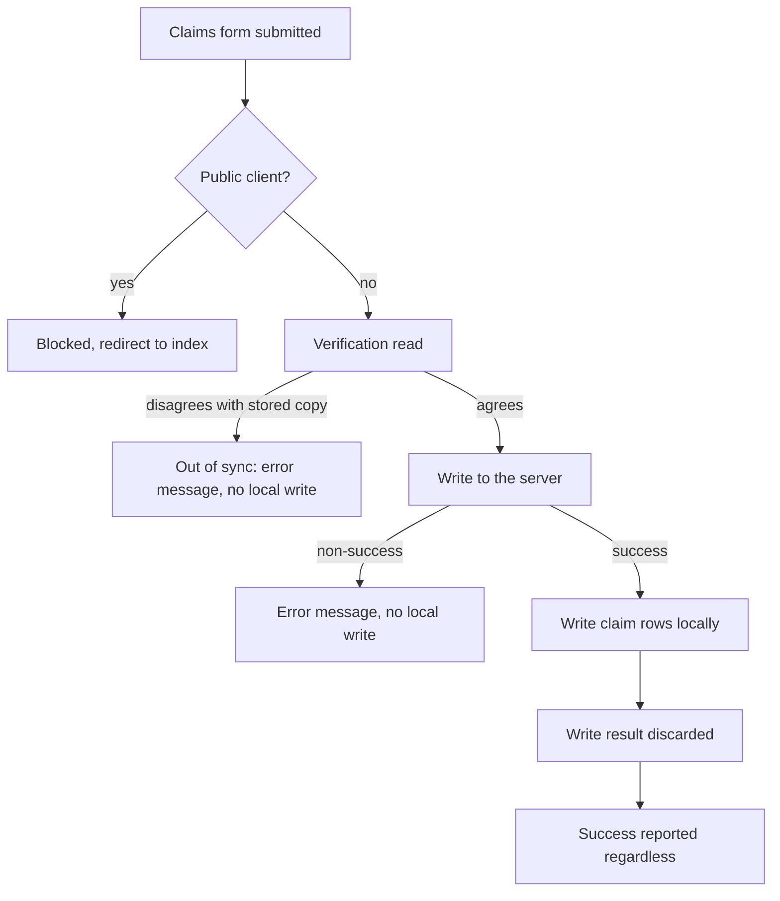
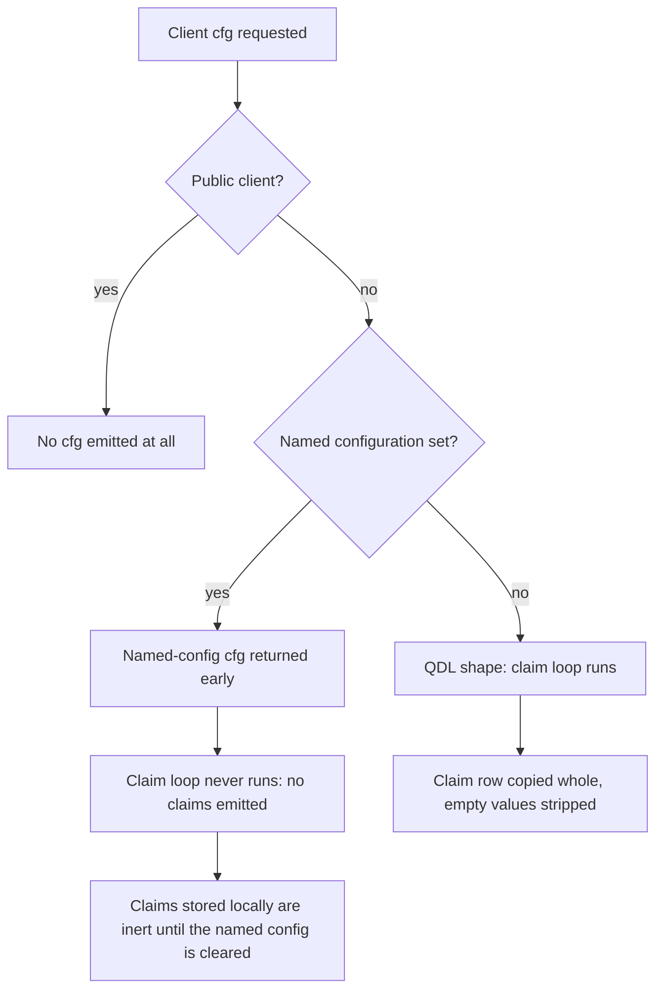
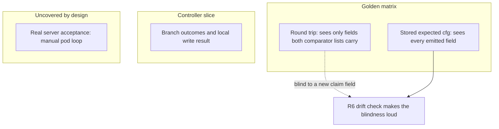

# Claims Regression Coverage - Plan

## Goal Capsule

- **Objective:** A change to the claims tab can be shipped knowing it has not silently altered any existing claim's behavior and has not left a client out of sync with the OA4MP server.
- **Means:** A golden cfg contract matrix over claim configurations, then a narrow controller slice over the claims write-path ordering, and two production fixes that land with the tests locking them.
- **Product authority:** Scott Koranda. Active scope is claims and what claims flow into. The rest of the plugin is not active scope.
- **Open blockers:** None. Principal risk: no test in this suite has ever driven a controller action. U8 establishes that it is possible before U9 depends on it.
- **Execution profile:** Verified red is mandatory for every regression test in this repo - each test must be observed failing against the pre-fix behavior, and the commit message must say so. See `Test/README.md`.

---

## Product Contract

**Product Contract preservation:** changed - R2, R3, R4, R6, R10, R11, R13 amended and R16 through R19 added, after research found the marshaller branches on no claim field and surfaced one live comparator inconsistency. R18 records a characterization requirement rather than a fix: the named-configuration exemption it was originally written against already exists, so only the comparator defect is fixed here. KD8 and KD9 record the scope changes, each confirmed with the product authority. R1, R5, R7, R8, R9, R12, R14, R15 and KD1 through KD7 are unchanged.

### Summary

Build a regression net around claims and the code claims flow into, so a new claims-tab feature cannot silently change an existing claim's emitted configuration or its sync state. A golden cfg contract matrix carries it; a narrow controller slice over the write-path ordering follows; and the two defects the net exposes are fixed alongside the tests that lock them.

### Problem Frame

The hermetic suite is nine test-case files, and every one of them traces to a documented bug, the authorization matrix, harness self-tests, or CI wiring. That narrowness was a deliberate choice in `docs/plans/2026-08-19-0342-test-plugin-test-suite-plan.md`, which picked targeted core coverage over breadth. The consequence is that 3,409 lines of controllers and 4,188 lines of models carry almost no coverage.

Verification today happens by copying a change into a subscriber's DEV Registry pod and exercising it there. That loop gives the highest fidelity available - a real Registry against a real OA4MP server - but it only exercises what gets clicked, on one subscriber's configuration. Nothing catches the claim configuration nobody thought to try.

The first anticipated feature is known. A subscriber has asked for a tickbox on a claim configured around group memberships: when ticked, the OA4MP server merges group membership asserted by the upstream IdP with the memberships obtained from DynamoDB, instead of using the DynamoDB memberships alone. That extends what a claim can express rather than reshaping the claims data model, so the matrix grows by rows rather than being rebuilt. A second claims-tab feature is also planned - `docs/plans/2026-07-02-001-feat-assert-email-verified-claim-plan.md` - which persists its flag as a third claim constraint and adds field unlocks to the claims view. Both features must be checked against this plan's coverage before the matrix axes are fixed.

The cost lands hardest on the plugin's two-sided state. When the plugin's stored copy of a client and the server's copy disagree, the sync guard blocks every subsequent edit, so a drifted client becomes unusable until someone repairs it by hand. That verdict is computed in one place but gates fourteen call sites across every tab of every client, so a wrong verdict is not a claims-only problem.

One inconsistency reaches that verdict today. Commit `7684cbb` tightened the marshaller to emit a claim constraint only when both its fields are populated, but left both sync-comparator sites on the looser rule. A cfg the plugin wrote before that commit can therefore carry a constraint the current marshaller would drop, and the client reports out of sync forever. Nothing tests the comparator's rule, so the divergence is invisible.

### Key Decisions

- KD1. **Scope the net to claims and what claims flow into.** Confidence shipping claims work is the goal, not a coverage number across the plugin. (session-settled: user-directed - chosen over whole-plugin breadth: the anticipated work is claims-tab features.)
- KD2. **Golden cfg contract matrix first; the controller ordering slice second.** The matrix has the highest regression catch per line written and protects the two-sided-state invariant directly. (session-settled: user-directed - chosen over controller-first sequencing and over a broad seam-level unit net.) Governs R1, R2, R3, R4, R5, R6.
- KD3. **Model validation and cascade coverage folds into the matrix work.** Those assertions are cheap to add while building matrix fixtures and do not warrant a separate workstream. (session-settled: user-approved.) Governs R2.
- KD4. **A changed expected cfg value means review, never re-record.** Characterization freezes current behavior including current bugs, so the review step is what keeps the matrix honest. (session-settled: user-approved.) Governs R5.
- KD5. **Production code may gain a seam solely to make the plugin's server object substitutable.** The claims controller constructs its own server object inline at four sites, so the controller slice is unreachable without one. The change is confined to that controller. (session-settled: user-approved - the testability change to production code was surfaced and accepted.) Governs R10, R11.
- KD6. **Whether a real OA4MP server accepts a new cfg shape stays with the manual subscriber DEV-pod loop.** The hermetic tier stubs the server, and the live tier has never been run. (session-settled: user-approved.)
- KD7. **Corrected behavior is locked by the tests that land with the fix.** A test written against current behavior would encode a defect whose consequence is a client permanently blocked from further edits. (session-settled: user-directed - chosen over characterizing current behavior and over leaving the cases uncovered.) Governs R8, R17.
- KD8. **The comparator inconsistency is fixed in this plan; the named-configuration defect is recorded and deferred.** Finishing commit `7684cbb` is a contained correctness fix. Gating the claims tab for named-configuration clients is a user-facing behavior change that would strand claims users have already created, so it belongs in its own brainstorm. (session-settled: user-directed - chosen over fixing both here and over dropping named-configuration work entirely.) Governs R17, R18.
- KD9. **The matrix varies what changes emitted output, not the enumerated option values.** The marshaller copies the whole claim row and strips empty values, branching on no claim field, so enumerating claim sources and formats would produce rows that all prove the same byte-copy. (session-settled: user-directed - chosen over enumerating the option values, and superseding the earlier one-dimension-at-a-time row policy, which is not well-defined once the claim source gates which options are reachable.) Governs R2, R6.

### Requirements

**Golden cfg contract matrix**

- R1. The suite carries a table-driven matrix of claim configurations, where covering an additional configuration means adding a row rather than adding a test file.
- R2. The matrix varies what changes emitted output: for each claim field that reaches the cfg, a row with the field populated, a row with it empty, and a row with it set to a string zero; and the cfg shape the client resolves to. Enumerated option values are covered only where the code couples them to another dimension, per the coupling list in KTD7.
- R3. Each row asserts the exact cfg the plugin emits for that configuration against a stored expected value, captured at the QDL claim-mapping marshaller rather than the outer content marshaller.
- R4. Each confidential QDL-shape row asserts the round trip: the emitted cfg, fed back through unmarshalling and sync verification, reports the client in sync. The public-client row and the named-configuration row carry their own assertions instead, per R2 and R18.
- R5. A changed expected cfg value fails the suite and is resolved by reviewing the behavior change; re-recording the expected value without that review is not an accepted resolution. A checklist item in `.github/pull_request_template.md` requires a changed expected value to name the behavior change it reflects.
- R6. The matrix's row set is checked against the authoritative enumerations in the claims view, and the claim fields the marshaller emits are checked against the field lists the unmarshaller and the sync comparator read. The emitted-field set is derived from the claim table's declared columns, never from a list maintained by hand. A claim field the marshaller emits that no comparator field list carries fails the suite.
- R16. One matrix row is database-backed, exercising a client with no per-client configuration row so the fallback read path is covered. Every other row builds its data in memory.

**Claims write-path ordering**

- R7. The suite asserts the outcome of each claims action - add, edit, and delete - for each outcome of the action's server call sequence: error, out of sync, and success. Out of sync is the plugin's own verdict on the verification read, not a result the server returns.
- R8. Each claims action reports failure rather than success when the server call sequence succeeds and the local write then fails, and the report names the resulting out-of-sync state and the repair the client now needs before it can be edited again.
- R9. The suite asserts that a public client is blocked from claim add and edit before any OA4MP call is made.

**Correctness fixes and characterization**

- R17. A claim constraint with only one of its two fields populated is treated identically by the marshaller and by the sync comparator, so such a claim does not report out of sync.
- R18. The exemption that stops a named-configuration client from being compared on its claims is locked by a test, so a later edit cannot remove it unnoticed.

**Harness enablement**

- R10. A test can substitute the plugin's server object for each claims action without a live server and without credentials. The substitution point is installable without a handle on the instance the controller constructs, and it intercepts every server call the action makes.
- R11. Any production-code change made solely to enable that substitution preserves current runtime behavior, and the substitution point is reachable from test code only - never from a configuration key, a public runtime setter, or request-derived data.
- R12. No test allows a controller action to terminate the runner process. A CakePHP redirect exits by default, which would end the suite mid-run with a success status and turn the merge gate silently green.

**Fixture hygiene**

- R13. Every checked-in expected cfg value and every seeded fixture credential - the configuration's access-key and secret fields, and the admin client's secret - uses a synthetic placeholder form that cannot match a scanner rule. This is an authoring constraint on the unit that writes the value, not a later cleanup: the scan walks full history, so a value committed once cannot be cleared by editing the working tree. Fixtures pass the existing secret-scan job with no new allowlist entry, and `.gitleaks.toml` keeps its default ruleset extension intact.

**Suite integration**

- R14. Every test added by this work runs in the hermetic tier and gates pull requests through the existing workflow; none requires a live OA4MP server.
- R15. Database-touching tests seed and tear down their own rows and avoid the in-process SELECT cache described in `Test/README.md`, which returns a stale result for a repeated identical query.
- R19. Each matrix row reports pass or fail individually, so a change that reddens several rows shows every one of them rather than stopping at the first.

### Key Flows

- F1. Claims write path
  - **Trigger:** A manager or editor submits the claims tab form for a client, or requests a claim deletion.
  - **Steps:** The controller loads the current client and blocks the action when the client is public. It calls the OA4MP server with the intended new state - a verification read first, then the write. On an error result or an out-of-sync result it sets an error message and falls through to the GET path. On success it writes the claim rows locally and redirects with a success message.
  - **Current gap:** The local write's result is assigned and never read, so success is reported whether or not the local write succeeded.
  - **Covered by:** R7, R8, R9

### Acceptance Examples

- AE1. **Covers R4.** Given a confidential client with a claim carrying two fully populated constraints, when the cfg is marshalled and fed back through unmarshalling and sync verification, then the client reports in sync.
- AE2. **Covers R2, R3.** Given a claim whose string-serialization delimiter is populated, when the cfg is marshalled, then the emitted value matches the stored expected value exactly; and given the same claim with that field empty, then the field is absent from the emitted cfg.
- AE3. **Covers R3, R17.** Given a claim carrying a constraint with an empty value, when the cfg is marshalled, then that constraint is absent from the emitted cfg, and the sync comparator also treats it as absent.
- AE4. **Covers R7.** Given a verification read whose body disagrees with the plugin's stored client, when a claim is added, then no claim row is written and the action reports the out-of-sync error.
- AE5. **Covers R8.** Given the server call sequence succeeds and the local write then fails, when a claim is added, then the action reports failure rather than success, and the report names the client as out of sync and needing repair before further edits.
- AE6. **Covers R9.** Given a public client, when the claim add action is requested, then the action is blocked before any OA4MP call is made.
- AE7. **Covers R16.** Given a client with no per-client configuration row, when the cfg is marshalled, then the fallback configuration's values are emitted, and sync verification against a server representation carrying those same values reports in sync.
- AE8. **Covers R18.** Given a client that uses a named configuration and carries claims, when its stored copy is compared against the server's, then the comparison returns before reaching the claim comparison and the client reports in sync.
- AE9. **Covers R6.** Given a claim field that the marshaller emits but that no comparator field list carries, when the suite runs, then it fails and names the field.

### Success Criteria

- A claims-tab feature can be developed against the suite, with the manual subscriber DEV-pod check narrowed rather than serving as a full regression sweep. The narrowed check still owns two things the hermetic tier cannot see: whether the real server accepts and returns the cfg shape, and whether the claims form still binds and renders. The form carries a set of security-component field unlocks, and a new control that misses one blackholes submission for every claim on the client - view-layer tests are out of scope and the harness never instantiates that component.
- Covering a newly supported claim configuration costs one matrix row.
- The suite continues to fit inside the hermetic job's existing CI budget.

### Scope Boundaries

- Whole-plugin breadth beyond what claims touch. The other controllers and the models with no coverage stay uncovered.
- The live-server tier and the test admin client it would need.
- View-layer and full page-rendering tests for the claims tab.
- Verification that a real OA4MP server accepts a new cfg shape. Per KD6 that stays with the manual loop.
- Automatic rollback of the server-side edit when the local write fails. The action reports the drift and the repair needed; performing the repair stays manual.
- Preventing claims on a client that uses a named configuration. Such claims are stored but never sent to the server, and become live if the named configuration is later cleared. Blocking them is a user-facing change that would strand claims already created, so it needs its own brainstorm - see Q1.
- The deprecated cfg marshalling shape. It has no callers and emits no claims.
- Legacy LDAP search-attribute migration beyond the path already covered by bug-trace tests.

### Dependencies / Assumptions

- Docker is required to run the hermetic suite locally through `Test/run.sh`.
- The thin runner ships no mocking framework and no PHPUnit. Its assertion surface has no deep-equality helper beyond a strict comparison, and no array-shape assertions.
- Assumption: the anticipated claims-tab features extend what a claim can express rather than reshaping the claims data model. Checked against both known features - the group-membership merge tickbox and the assert-verified flag - and it holds for each. The assert-verified work adds a third claim constraint and new field unlocks to the claims view, so two compatibilities must be confirmed when it is scheduled: that U4's view-source read still finds the enumerations it depends on, and that U6's tightened constraint rule does not drop a constraint whose values are non-empty strings. It stops holding if a new claim field carries a populated default, which changes the emitted cfg for every claim that sets it; a new field must default empty for row-by-row review to remain possible.
- Assumption: the group-membership merge is honored on the OA4MP server's side by its QDL, which this plugin does not control. The suite can lock what the plugin emits for a merged-membership claim; whether the server merges correctly stays with the manual loop per KD6.
- A new claim field is dropped by the unmarshaller and both comparator field lists, which are fixed whitelists. Its round trip therefore reports in sync regardless of behavior, and only the stored expected value catches a change. R6 exists to make that failure loud rather than silent.

---

## Planning Contract

### Key Technical Decisions

- KTD1. **The seam is a server-object factory on the claims controller, not an HTTP transport seam.** The claims controller constructs its own server object inline at four sites, so a seam inside the server model is unreachable from a controller test; one factory method overridden in a test-only subclass intercepts every call each action makes, because the edit call performs its verification read internally. The other thirteen construction sites across eight controllers are untouched, and no shared base class widens the change - every plugin controller extends the Registry core controller directly. Governs R10, R11.
- KTD2. **Controller tests use a test-only subclass that overrides `redirect()`.** Both CakePHP's and COmanage's `redirect()` are public and both exit by default. Overriding it in the subclass neutralizes the exit hazard and captures the redirect target, with no production change. The override records the target and then throws a dedicated harness exception that the invoke helper catches: a redirect that merely returned would let the public-client guard and the success paths fall through into code the production actions assume is unreachable. The subclass hand-assigns the request, flash double, and CO context, and calls `loadModel()` - it must never call `constructClasses()`, which would instantiate the authentication, security, and session components. Governs R7, R9, R12.
- KTD3. **Do not shadow `HttpSocket` with a stub class.** `Console/Command/Oa4mpTestShell.php` requires every file under `Test/Stub/` in both the hermetic and the live run, so a stub transport would silently break `Test/run-live.sh`. Rejected in favor of KTD1.
- KTD4. **Golden values are captured at the QDL claim-mapping marshaller.** The outer content marshaller embeds an absolute URL built from the application's base URL on every call, which nothing pins in the test environment, so an expected value captured there would be environment-dependent. Governs R3.
- KTD5. **One test method per matrix row.** The runner reports pass or fail per `test*` method and its failure helper throws, so a loop over rows inside one method stops at the first drifted row and reports one failure. Per-method rows give per-row attribution, which is what makes the review discipline workable. Governs R19, R5.
- KTD6. **Matrix rows build data in memory, except the one fallback row.** The marshalling entry points take a data array directly, which is the existing idiom and needs no database. The single database-backed row exists because the configuration-fallback defect lives in a database read that in-memory rows bypass. Governs R2, R16.
- KTD7. **The comparator adopts the marshaller's rule for half-populated constraints.** The marshaller emits a constraint only when both fields are populated; the comparator keeps it when either is. This is a half-finished change, not a design: commit `7684cbb` tightened the marshaller and touched no other file. Finishing it means changing the comparator, not the marshaller. Governs R17.
- KTD8. **Coupled dimensions that must be crossed.** The claims view gates which options each claim source exposes, so these pairs are crossed and the rest are varied singly: claim source with constraint count; claim source with value format; claim source with value selection; claim source with serialization mode; serialization mode with the delimiter field, precisely because the marshaller does not couple them and emits a delimiter set alongside a non-delimited serialization. Governs R2.

### High-Level Technical Design

Two things drive the design and neither is obvious from the requirements alone: which cfg shape a claim can reach, and where each test layer is blind.

**Claim configurations reach exactly one cfg shape.** The named-configuration branch returns before the claim loop runs, so a named-configuration client emits no claims at all - while the comparator still expects them. That asymmetry is defect R18.

**What each layer can and cannot see.** The matrix and the controller slice are blind in different directions, and R6 exists to cover the overlap where both are blind.

### Assumptions

None beyond those recorded in the Product Contract.

### Sequencing

The matrix lands first per KD2, so the two correctness fixes have golden rows to prove themselves against. The controller seam and harness (U8) is the risk-bearing unit and establishes drivability before U9 depends on it; if U8 proves controller drivability is not reachable, U9 is the only unit that fails and the matrix work still stands.

### System-Wide Impact

The sync verdict is computed in one function but consumed far beyond claims. It is called from a single production site, inside the client verification routine, and that routine is reached from fourteen places: the GET gate on every client tab (access controls, access tokens, authorizations, claims add / edit / index, callbacks add / edit / delete, named-config manage, client edit, scopes, refresh tokens) and the write gate inside the client edit call, which nine controllers use across fifteen sites.

**U6 therefore changes drift detection for every client and every tab, not only for claims.** The change relaxes the verdict for every value pair the marshal round trip can actually produce: the same filter is applied to both sides of the comparison, so a client whose claim data round-trips through it and reports in sync today cannot start reporting out of sync as a result of U6. One value pair sits outside that guarantee. `source_model_claim_value_field` holding the plugin value `'0'` against the server value `'0.0'` compared loosely true before the fix - both are numeric strings under PHP's `==` - so the pair reported in sync. After the emptiness normalisation, `empty('0')` is true so `'0'` becomes null while `'0.0'` survives, and `null == '0.0'` is false, so the pair now reports out of sync; verified by running PHP directly. The constraint form is sharper still: the plugin's `('f', '0')` pair is dropped by the same rule while the server's `('f', '0.0')` pair is kept, so the two sides' constraint counts differ. `'0'` and `'0.0'` are genuinely different values, so the new verdict is the more correct one - this narrows the claim about the change's reach, it is not a defect in U6. Two further consequences follow from the general relaxation.

- The intended one: a client whose stored copy carries a half-populated constraint that the current marshaller drops stops reporting out of sync, and becomes editable again on every tab rather than none.
- The one worth naming: where the server's copy carries such a constraint and the plugin's does not, the mismatch stops being reported. The effective configurations are identical, since the marshaller would never emit that constraint, but a real difference in stored server content becomes invisible. U6's comparator log is the mitigation.

U7 changes no production behavior. U8's factory is confined to the claims controller; the other thirteen construction sites across eight controllers are untouched, and no plugin controller inherits from another, so nothing widens it. U9 changes the three claims actions only.

### Risks and Mitigations

| Risk | Mitigation |
|---|---|
| U6 masks a genuine server-side difference, and the next edit through any tab silently rewrites it away | Log at the comparator whenever a constraint is dropped for being half-populated, so the state is greppable even though the verdict no longer reflects it |
| U6's own regression test accidentally encodes the masking as intended behavior | Its drift-detection scenario compares fully populated against fully populated; a half-against-full pair is explicitly disallowed |
| U8's factory name collides with a member of the Registry core controller the plugin extends | Grep Registry core for the chosen name before committing; follow the existing local helper's naming shape |
| U8's seam becomes reachable from configuration or request data, redirecting the admin credential every request carries | R11 constrains reachability to test code; U8 asserts the production default and the seam's visibility |
| U8 proves controller drivability is not reachable at all | U8 is sequenced before U9 and carries a stop condition: report rather than expand the production change. The matrix work in U1 through U5 stands independently |
| A future edit removes the named-configuration exemption U7 depends on | U7 binds to it directly, and its first scenario is verified against the exemption's temporary removal |

---

## Implementation Units

### U1. Matrix scaffolding and emptiness-axis rows

- **Goal:** A table-driven golden matrix exists, with one row per emptiness variation of each claim field that reaches the cfg.
- **Requirements:** R1, R2, R3, R4, R5, R13, R19; KTD4, KTD5, KTD6, KTD8
- **Dependencies:** none
- **Files:** `Test/Case/Model/ClaimCfgContractTest.php` (create), `Test/lib/Oa4mpClaimRows.php` (create)
- **Approach:**
  1. Add a shared row-builder helper under `Test/lib/` so the runner auto-requires it. It returns a baseline confidential-client data array with one claim, in the shape the existing marshalling tests already build.
  2. Give each row its own `test*` method per KTD5, each delegating to a private assertion helper that takes the row's overrides and its expected cfg.
  3. Capture expected values at the QDL claim-mapping marshaller per KTD4.
  4. Cover each claim field that reaches the cfg three ways: populated, empty, and set to a string zero. The three layers disagree about a string zero - the marshaller and unmarshaller use the emptiness test while one comparator read uses a null coalesce - so each string-zero row asserts the comparator's verdict agrees with the emitted cfg, not merely that the field is absent.
  5. Cross only the pairs KTD8 names; vary the rest singly.
  6. Expose the declared row set from the row-builder helper as a static method - claim source and covered dimension per row, plus any exemptions - so U4 can read it. The per-row test methods are not machine-readable and live in a different file.
  7. Write every credential-shaped value as the synthetic placeholder from the start, per R13. Do not defer it to U5.
- **Patterns to follow:** the hand-built data arrays and private `server()` accessor in `Test/Case/Model/CfgMarshallingTest.php`; the per-case message style in `Test/Case/Controller/Component/Oa4mpClientAuthzComponentTest.php`.
- **Execution note:** Several scenarios are already locked by `Test/Case/Model/CfgMarshallingTest.php` and `Test/Case/Model/SyncVerificationTest.php`. Read both before writing rows and extend rather than re-assert; note in the test docblock which existing method already covers a scenario you skip.
- **Test scenarios:**
  - Each claim field populated: the emitted cfg carries it with the exact value and scalar type.
  - Each claim field empty: the field is absent from the emitted cfg entirely.
  - Delimiter field set to a string zero: absent from the emitted cfg, because the emptiness strip treats it as empty.
  - A claim with no constraints: emits no constraint key, and raises no warning.
  - A claim with two fully populated constraints: both emitted.
  - Covers AE2. A populated delimiter matches its stored expected value; the same row with the delimiter empty omits the field.
  - Each string-zero row: the sync comparator's verdict agrees with the emitted cfg.
  - Covers AE1. A confidential row with two fully populated constraints, marshalled and fed back through unmarshalling and sync verification, reports in sync.
  - Each row's assertion failure message names the row, so a multi-row regression is attributable.
- **Verification:** `Test/run.sh` passes; every row appears as its own pass line in the runner output.

### U2. Configuration-shape rows

- **Goal:** The matrix covers which cfg shape a client resolves to, not only the QDL shape.
- **Requirements:** R2, R4
- **Dependencies:** U1
- **Files:** `Test/Case/Model/ClaimCfgContractTest.php` (modify)
- **Approach:** Add a public-client row and a named-configuration row. Neither carries a QDL-shape expected value: the public row asserts no cfg is attached at all, and the named-configuration row asserts structural facts - the named-config content is merged and no claim-mappings key is present - rather than a stored value. Exclude the named-config metadata key from that comparison: the named-configuration branch builds it with the absolute URL builder, so it is environment-dependent even at the QDL marshaller. Both rows are exempt from the round-trip assertion per R4.

The named-configuration row's docblock states that the behavior it asserts is the deferred inert-claims defect, cites Q1, and links the learning document recording it.
- **Patterns to follow:** `Test/Case/Model/CfgMarshallingTest.php` already locks the public-client case; extend rather than duplicate it, and cite it in the docblock.
- **Test scenarios:**
  - A public client carrying claims: no cfg is attached.
  - A named-configuration client carrying claims: the named-config shape is returned and carries no claim mappings.
  - A confidential client with no named configuration: the QDL shape is returned and carries the claim mappings.
- **Verification:** `Test/run.sh` passes.

### U3. Database-backed configuration-fallback row

- **Goal:** The matrix reaches the configuration-fallback read path that in-memory rows bypass, closing the gap named in `docs/solutions/logic-errors/oa4mp-dynamo-config-hasone-phantom-null-array-2026-06-30.md`.
- **Requirements:** R16, R15, R13
- **Dependencies:** U1
- **Files:** `Test/Case/Model/ClaimCfgFallbackTest.php` (create)
- **Approach:** Seed a CO, an admin client with a default configuration row, and an OIDC client with no per-client configuration row. Marshal through the entry point that resolves the configuration from the database rather than from a supplied array, assert the fallback values are emitted, then assert sync verification against a server representation carrying those same values reports in sync. Tear down explicitly, purging the configuration rows the save path creates. Seed every credential field with the synthetic placeholder from the start, per R13.
- **Patterns to follow:** the fixture seeding and explicit purge in `Test/Case/Controller/AdminClientEditSaveTest.php`; the reusable valid-configuration array in `Test/Case/Model/ClaimMigrationPersistenceTest.php`.
- **Execution note:** This is the one row that touches the database. Respect the repeated-query SELECT cache documented in `Test/README.md` - do not issue the same query twice in one method around a write.
- **Test scenarios:**
  - Covers AE7. A client with no per-client configuration row emits the fallback configuration's values.
  - The same client's emitted cfg, compared against a server representation carrying those values, reports in sync.
  - A client that does have a per-client row emits that row's values instead, as a positive control.
  - Teardown leaves no configuration rows behind.
- **Verification:** `Test/run.sh` passes; running it twice in a row passes both times, proving teardown is complete.

### U4. Enumeration and comparator-whitelist drift check

- **Goal:** A supported option with no matrix row, or a claim field the marshaller emits that the comparator cannot see, fails the suite.
- **Requirements:** R6
- **Dependencies:** U1
- **Files:** `Test/Case/Model/ClaimCfgDriftTest.php` (create)
- **Approach:** Read the authoritative option lists out of the claims view source and compare them against the row set the row-builder helper declares. Separately, derive the emitted-field set from the claim table's declared columns in `Config/Schema/schema.xml`, minus the keys the marshaller unsets, and compare it against the field lists the unmarshaller and the sync comparator read; fail and name any field present in the first and absent from the others. Derive, never declare - a hand-maintained list is updated by the same person adding the column, so the check would never fire. Note the claim table is declared twice in that file with identical fields; tolerate the repeat.
- **Patterns to follow:** the source-text inspection idiom in `Test/Case/CiWorkflowTest.php` and `Test/Case/Controller/AdminClientEditSaveTest.php`, which read a file and assert on an extracted block.
- **Test scenarios:**
  - Covers AE9. A claim field the marshaller emits that no comparator field list carries fails, and the failure message names the field.
  - Every claim source the view offers has a matrix row or an explicit declared exemption.
  - A positive control introduced into the derivation source, not into the test's own input, is detected. A control injected downstream of the derivation passes even when the derivation has gone stale, which is the failure this check exists to prevent.
- **Verification:** `Test/run.sh` passes; the positive control is observed failing when its guard is removed.

### U5. Fixture hygiene and the review checklist

- **Goal:** Checked-in expected values cannot leak a credential or redden the secret scan, and a changed expected value is visible to a reviewer.
- **Requirements:** R13, R5
- **Dependencies:** U1, U3
- **Files:** `Test/Case/Model/ClaimCfgContractTest.php` (modify), `Test/Case/Model/ClaimCfgFallbackTest.php` (modify), `.github/pull_request_template.md` (modify)
- **Approach:** U1 and U3 write placeholders from the start per R13, so this unit verifies rather than scrubs. Assert that no checked-in expected value or seeded credential in either file carries a scanner-matching string. Add one checklist item to the pull request template requiring a changed expected value to name the behavior change it reflects. Do not add a `.gitleaks.toml` allowlist entry and do not touch its default-ruleset extension - `Test/Case/CiWorkflowTest.php` already locks those properties.
- **Patterns to follow:** the existing checklist items in `.github/pull_request_template.md` - same prefix, sentence case, backticked paths, six-space continuation indent, ASCII only.
- **Test scenarios:**
  - No stored expected value or seeded credential in either file contains a string matching the scanner's key pattern.
  - Every credential-shaped field holds the placeholder, including the admin client's secret, not a realistic value.
  - Test expectation for the template change: none - documentation only, and the existing CI workflow test already covers the scan configuration.
- **Verification:** `Test/run.sh` passes and the secret-scan job passes on the branch.

### U6. Constraint asymmetry fix

- **Goal:** A claim carrying a half-populated constraint no longer reports out of sync.
- **Requirements:** R17; KTD7
- **Dependencies:** U1
- **Files:** `Model/Oa4mpClientOa4mpServer.php` (modify), `Test/Case/Model/ClaimConstraintSymmetryTest.php` (create), a `docs/solutions/logic-errors/` learning for the comparator inconsistency (create)
- **Approach:** The marshaller emits a constraint only when both fields are populated; the two comparator normalizations keep it when either is. Change both comparator sites to the marshaller's rule so the two sides agree. Do not change the marshaller - commit `7684cbb` already set its rule and this finishes that commit. Log at the comparator when a constraint is dropped for being half-populated, so the state the change makes invisible is at least greppable. The log records the client identifier and the constraint's field name only; any row-shaped payload passes through the file's existing redaction helper first. Write the learning document and link it from the regression test's docblock.
- **Patterns to follow:** the existing constraint guard in the marshaller, including its comment explaining why both fields are required.
- **Execution note:** Verified red. Observe the new test failing against current behavior before the fix, and say so in the commit message.
- **Test scenarios:**
  - Covers AE3. A claim with a constraint whose value is empty marshals to no constraint, and the comparator also sees none, so the client reports in sync.
  - The same for a constraint whose field is empty.
  - A claim with a fully populated constraint still reports in sync, as a positive control.
  - A claim whose constraints differ between the two sides, both sides fully populated, still reports out of sync. The pair must be fully-populated against fully-populated: a half-against-full pair would encode the new masking as intended behavior rather than testing drift detection.
- **Verification:** `Test/run.sh` passes; `php -l Model/Oa4mpClientOa4mpServer.php` is clean.

### U7. Named-configuration exemption characterization

- **Goal:** The existing exemption that stops a named-configuration client being compared on its claims is locked, so a later edit cannot remove it unnoticed.
- **Requirements:** R18
- **Dependencies:** U2
- **Files:** `Test/Case/Model/NamedConfigClaimSyncTest.php` (create), a `docs/solutions/` learning recording the named-configuration inert-claims defect as open (create)
- **Approach:** No production change. The comparator already returns early for a named-configuration client, well before the claim comparison, and has since the file was created. Assert that behavior directly, and assert that the claim comparison is not reached, so a future edit that moves or deletes the early return fails here rather than in production.
- **Patterns to follow:** the comparator assertions in `Test/Case/Model/SyncVerificationTest.php`.
- **Execution note:** This unit is characterization, not a fix - it passes on first write, and the verified-red rule does not apply. The exemption is locked provisionally pending Q1: a remedy for the inert-claims defect that changes how the comparator treats named-configuration clients is expected to change this test, not to be blocked by it. The docblock states that, cites Q1, and links the learning document. Do not attempt to observe it failing; if it does fail before any change, the exemption is not where this plan says it is and the finding should be re-investigated before proceeding.
- **Test scenarios:**
  - Covers AE8. A named-configuration client carrying claims reports in sync against a server representation with no claims.
  - A named-configuration client with no claims also reports in sync, as a positive control.
  - A client with no named configuration whose claims genuinely differ still reports out of sync, proving the early return is the reason for the first result and not a blanket pass.
- **Verification:** `Test/run.sh` passes; the first scenario (AE8, the named-configuration client carrying claims) is observed failing when the early return is temporarily removed, proving the test binds to the exemption. The third scenario cannot bind - it uses a client with no named configuration, so the early return is never reached.

### U8. Controller seam and test harness

- **Goal:** A claims controller action can be driven and asserted from the hermetic tier.
- **Requirements:** R10, R11, R12, R15; KTD1, KTD2, KTD3
- **Dependencies:** none, but sequenced after the matrix per KD2
- **Files:** `Controller/Oa4mpClientClaimsController.php` (modify), `Test/lib/Oa4mpClaimsControllerHarness.php` (create), `Test/Case/Controller/ClaimsControllerHarnessTest.php` (create), `Test/run.sh` (modify)
- **Approach:**
  1. Add one protected factory method on the claims controller returning the server object, and replace the four inline constructions with calls to it. No other production change.
  2. Add a test-only subclass under `Test/lib/` that overrides the factory to return a fake, overrides `redirect()` to record the target and then throw a dedicated harness exception, and declares the flash property so no dynamic property is created. The invoke helper catches that exception and exposes the recorded target. A redirect that returned instead would let the public-client guard and the success paths fall through into code the actions assume is unreachable.
  3. The harness assigns a hand-built request carrying the named client parameter and any posted data - always including the constraint key, which two actions dereference unconditionally - assigns the CO context, and calls `loadModel()` for the claim model. It must not call `constructClasses()`.
  4. Seed a client graph per harness test with the fixture helper: a CO, an admin client with a default configuration, and an OIDC client with claims. Purge it in teardown. The actions load that graph across many associations and cannot run without it.
  5. Change `Test/run.sh` to require the runner's all-passed sentinel in the output and fail without it, so a mid-run exit reddens the gate instead of passing it. R12's hazard needs a mechanical backstop, not only the harness override.
  6. Add a self-test proving the harness works before U9 relies on it.
- **Patterns to follow:** the bare component construction with an empty collection in `Test/Case/Controller/Component/Oa4mpClientAuthzComponentTest.php`; the harness self-test shape in `Test/Case/HarnessSelfTest.php`.
- **Execution note:** This unit carries the plan's principal risk. Prove drivability with the self-test before writing U9's assertions. If the harness cannot be made to work, stop and report rather than expanding the production change.
- **Test scenarios:**
  - The harness can invoke a claims action and the runner survives - no process exit, and a following test in the same file still runs.
  - The overridden redirect records its target rather than exiting.
  - The fake server object is the one the action uses, proven by returning a distinctive verdict and observing the branch taken.
  - The factory's production default returns a real server object, so runtime behavior is unchanged.
  - The substitution point is not reachable from configuration or request data.
  - A test that deliberately exits mid-run causes the suite to fail rather than report green, proving the sentinel check works.
  - Teardown leaves no seeded rows behind.
- **Verification:** `Test/run.sh` passes; `php -l Controller/Oa4mpClientClaimsController.php` is clean; the suite's total test count increases and no existing test regresses.

### U9. Write-path ordering fix and controller slice

- **Goal:** Each claims action reports the truth about what happened, and the suite asserts it for every branch.
- **Requirements:** R7, R8, R9, R15; realizes F1; KD7
- **Dependencies:** U8
- **Files:** `Controller/Oa4mpClientClaimsController.php` (modify), `Test/Case/Controller/ClaimsWritePathTest.php` (create)
- **Approach:**
  1. In each of the three actions, check the local write's result instead of discarding it. On failure, report failure and name the resulting out-of-sync state and the repair needed, rather than reporting success. Follow the atomic-pair-then-tail-step rule from `docs/solutions/logic-errors/oa4mp-claim-migration-three-latent-bugs-2026-05-18.md`; do not add a coarse outer gate.
  2. For add and edit, the new local-write-failure branch also redirects to the claims index rather than falling through to the GET path its own out-of-sync and server-error branches use. The redirect does not rest on a second flash message overwriting the first under the same key: CakePHP's `FlashComponent::set()` defaults `clear` to false and appends to the array for that key rather than replacing it, and `FlashHelper::render()` loops over every message the array holds, so messages stack and both would render. The redirect is correct anyway, for reasons that do hold: the GET tail clears the posted data, so falling through would return nothing to the form; the GET tail re-verifies, finds the drift this failure just created, and redirects to the index regardless, so falling through buys nothing; redirecting here costs one server call where falling through would cost three; and the out-of-sync branch's own redirect omits `plugin` and `controller`, so it resolves to the index without `clientid` - a different destination than this branch's specific redirect.
  3. Add the user-facing strings to `Lib/lang.php` rather than the controller.
  4. The delete action's new failure branch sets the error flash and redirects to the claims index. Do not give it the fall-through shape its sibling error branches use - there is no delete view to render, so falling through raises a missing-view error instead of showing the message.
  5. Drive each action through the harness for each branch, seeding and purging a client graph per test per R15. Force the local write to fail deterministically: omit a required claim field for the save paths, and pass an id that does not exist for the delete path.
- **Patterns to follow:** the existing flash-and-redirect shape in the three actions; the claim model's required-field validation rules for forcing a save failure.
- **Execution note:** Verified red for the ordering fix. The delete action's error and out-of-sync branches do not redirect at all, so start there - they are assertable with no redirect handling and give the earliest signal that the harness works end to end.
- **Test scenarios:**
  - Covers AE4. For each action, an out-of-sync verification read leaves no local write and reports the out-of-sync error.
  - For each action, a non-success server write leaves no local write and reports the error.
  - For each action, a successful sequence performs the local write and reports success.
  - Covers AE5. For add and edit, a successful sequence followed by a failing local write reports failure and names the drift and the repair.
  - For delete, the same with a nonexistent id.
  - Covers AE6. A public client is blocked from add and from edit before any server call is made, proven by the fake recording no calls.
  - The success flash is not set on any failure branch.
  - The delete action's local-write-failure branch redirects rather than falling through, so no view is sought.
  - Teardown leaves no claim rows behind.
- **Verification:** `Test/run.sh` passes; `php -l` clean on both changed files; each new user-facing string resolves through the localization file.

---

## Verification Contract

| Gate | Command | Applies to | Done signal |
|---|---|---|---|
| Hermetic suite | `Test/run.sh` | U1-U9 | The script fails unless the runner's all-passed sentinel appears, so a mid-run exit cannot report green |
| PHP lint | `php -l <file>` | U6, U7, U8, U9 | No syntax errors on each changed PHP file |
| Secret scan | the existing scan job on the branch | U5 | Job passes with no new allowlist entry |
| Verified red | observe each regression test failing pre-fix | U6, U9 | Commit message records the observed failure. U7 is characterization and is exempt |
| Teardown completeness | `Test/run.sh` twice consecutively | U3, U8, U9 | Both runs pass |

Behavior that talks to a real OA4MP server cannot be verified from this repository. Per KD6, validate the group-membership merge and any new cfg shape manually in a subscriber's DEV Registry.

---

## Definition of Done

- Every requirement R1 through R19 is satisfied or explicitly deferred in the plan.
- Every acceptance example AE1 through AE9 has a test asserting it.
- The two production fixes - the comparator rule in U6 and the write-path ordering in U9 - each land with the test that locks them, each observed failing first. U7 is characterization and is exempt.
- The hermetic suite passes and gates the pull request; the secret scan passes with no new allowlist entry.
- U4's drift check passes, and its positive control was observed failing when its guard was removed.
- The pull request template carries the expected-value review item.
- A `docs/solutions/` learning is written for the comparator inconsistency, linked from its regression test, and one recording the named-configuration inert-claims defect as open.

---

## Open Questions

**Deferred to implementation**

- Q1. What to do about claims on named-configuration clients. The claims tab is ungated for them, so a user can create claims that are silently inert and that become live if the named configuration is cleared. Clearing a named configuration activates every previously inert claim at once, so a relying party begins receiving identity attributes nobody reviewed at the moment they went live. The remedy must therefore cover claims already stored, not only future tab gating, and that plus the treatment of existing data is a product decision. Out of scope here; recorded so it is not lost.
- Q2. Whether expected cfg values live in separate fixture files or inline in the test. Both satisfy R3; inline matches the existing hand-built-array idiom, separate files make a changed value easier to review in a diff.

---

## Sources / Research

- `Test/README.md` - thin-runner contract, assertion surface, the repeated-query SELECT cache, and the record that the live tier has never been run against a real server.
- `Test/lib/Oa4mpTestCase.php`, `Test/lib/Oa4mpFixtures.php` - the assertion surface and fixture helpers; there is no claim or configuration helper, so those are seeded directly.
- `Console/Command/Oa4mpTestShell.php` - per-method discovery and reporting, the requirement that class name match filename, and the stub loading that rules out KTD3's alternative.
- `Test/Case/Model/CfgMarshallingTest.php`, `Test/Case/Model/SyncVerificationTest.php` - existing coverage the matrix extends rather than duplicates, including the public-client case and the QDL and legacy round trips.
- `Test/Case/Controller/AdminClientEditSaveTest.php` - fixture seeding with a default configuration row, explicit purge, and the source-inspection idiom.
- `Controller/Oa4mpClientClaimsController.php` - the four inline server-object constructions, the redirect sites, and the discarded local-write result in all three actions.
- `Model/Oa4mpClientOa4mpServer.php` - claim marshalling and the emptiness strip, the constraint rule, the named-configuration early return, the comparator normalizations, and the absolute URL in the outer content marshaller.
- `View/Oa4mpClientClaims/fields.inc` - the authoritative option enumerations and the per-source gating that KTD8 encodes.
- `.github/pull_request_template.md`, `.gitleaks.toml`, `Test/Case/CiWorkflowTest.php` - the review checklist U5 extends and the scan properties it must not disturb.
- `docs/plans/2026-08-19-0342-test-plugin-test-suite-plan.md` - the targeted-core scope decision this plan extends.
- `docs/plans/2026-07-02-001-feat-assert-email-verified-claim-plan.md` - the second planned claims-tab feature, whose third claim constraint and view field unlocks the matrix and the drift check must stay compatible with.
- `docs/solutions/logic-errors/oa4mp-dynamo-config-hasone-phantom-null-array-2026-06-30.md` - names the untested agreement between the marshalling and comparison call sites; U3 closes it.
- `docs/solutions/logic-errors/oa4mp-claim-migration-three-latent-bugs-2026-05-18.md` - the atomic-pair-then-tail-step rule U9 follows.
- `docs/solutions/integration-issues/oa4mp-public-client-cfg-rejected-2026-08-03.md` - the public-client contract and the untested controller guard U9 closes.
- `docs/solutions/integration-issues/oa4mp-gitleaks-secret-scan-usedefault-trap-2026-08-22.md` - why U5 adds no allowlist entry and leaves the default-ruleset extension intact.
- `docs/solutions/logic-errors/oa4mp-unmarshall-claim-comparator-drift-2026-05-05.md` - the writer/comparator symmetry rule that R6 generalizes.
- CakePHP 2.10 documentation - `Controller::redirect()` exits by default and its stop helper wraps `exit()`, which is why KTD2 overrides it; component construction with a bare collection; save and delete return semantics used to force deterministic write failures.
