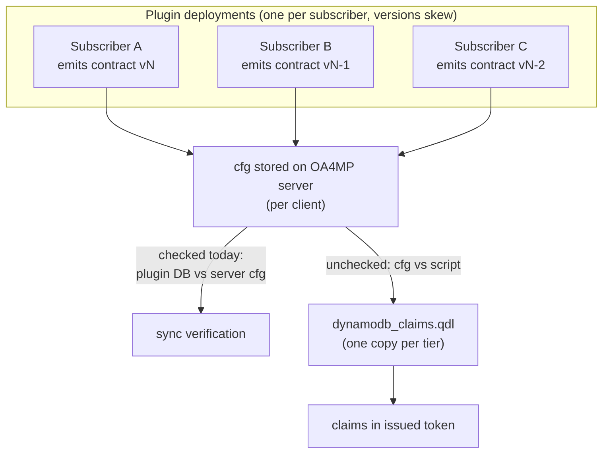
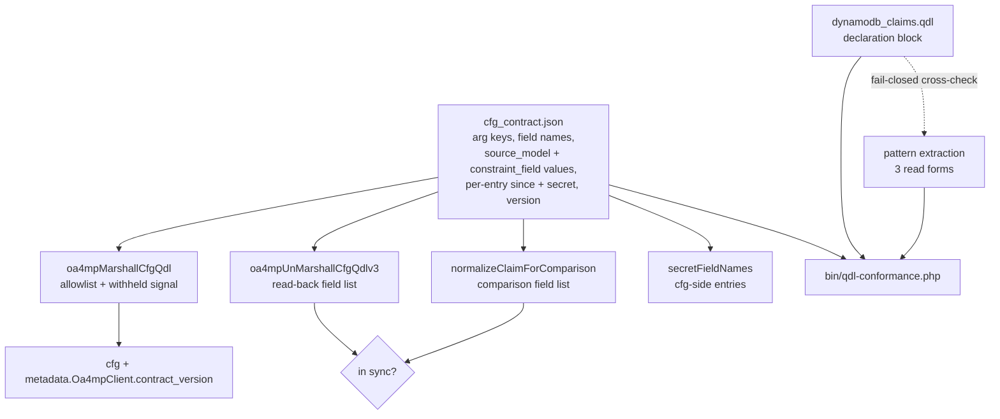

# Plugin-QDL Claim Contract - Plan

## Goal Capsule

- **Objective:** A plugin change that would break DynamoDB-backed claim production on the OA4MP server cannot land unnoticed, and anyone can verify a given tier's `dynamodb_claims.qdl` source against the contract the plugin builds against. The LDAP consumer is not covered. Answering the same question about what a tier has actually *deployed*, for a specific plugin version, depends on the runtime version handshake and the census reader, both deferred.
- **Means:** A versioned capability contract vendored in this repository, enforced in plugin CI, plus a local check that verifies the QDL implements it. The cfg carries the contract version it was built against.
- **Product authority:** The repository owner.
- **Open blockers:** None. All Outstanding Questions are deferred to planning.

---

## Product Contract

### Summary

Declare what the plugin may put in a client's `cfg` as a versioned, machine-readable contract; make the marshaller structurally incapable of emitting anything undeclared; and add a local check that verifies a named tier's QDL source implements at least that contract. Every cfg starts carrying the contract version it was built against.

### Problem Frame

The plugin marshals a `cfg` that the OA4MP server hands to `dynamodb_claims.qdl`, a script maintained in a separate private repository. Nothing anywhere declares what that cfg may contain, and three properties of the current code combine to make silent divergence the default outcome.

The marshaller is an open-ended writer. `oa4mpMarshallCfgQdl` copies the whole claim row (`Model/Oa4mpClientOa4mpServer.php:954`) and then removes a denylist of five keys (`:978-982`); constraints get the same treatment (`:960-973`). Adding a column to `oa4mp_client_claims` therefore starts emitting a new QDL arg with no edit to the marshaller and no diff for a reviewer to catch.

The QDL absorbs anything it does not recognize. An unrecognized `source_model` produces `log_line('No handler for source model ' + source_model + ', skipping')` (`dynamodb_claims.qdl:254`); unknown arg keys are simply never read; absent keys fall back to defaults. Nothing raises. The symptom of divergence is a claim quietly missing from an issued token.

The contract artifact that exists leaves the important vocabularies open. `cfg_schema.json` types `source_model` and `constraint_field` as `{"type":"string","minLength":1}` with no enumeration, though the QDL dispatches on exact literals. One instance is already sitting in the repository: `sort_key` and `sort_key_template` are declared in `cfg_schema.json` and compared by the sync comparator (`Model/Oa4mpClientOa4mpServer.php:553-570`), but are never marshalled into a cfg and appear nowhere in the QDL's 918 lines.

The existing sync verification cannot see any of this. It compares the plugin's stored copy of a client against the server's stored cfg. Both can agree exactly while the script that consumes the cfg does not understand it. Plugin-to-server drift and cfg-to-QDL drift are different axes, and only the first has a check.

The deployment topology decides the shape of any remedy. One QDL copy is deployed per tier (DEV, TEST, PROD), serving every subscriber at once, while the plugin is deployed per subscriber and those deployments do not advance together — a feature is commonly rolled out for one subscriber first and the rest catch up later. So at any moment a single QDL must satisfy many plugin versions simultaneously.

### Requirements

**The contract artifact**

- R1. The plugin repository carries a machine-readable capability contract enumerating every cfg QDL arg key, every claim-mapping and constraint field name, every `source_model` value, and every `constraint_field` value the plugin may emit.
- R2. The contract carries a version identifier that advances whenever the capability set changes — on a removal as well as an addition — so the version at which a capability stopped being emitted is a real, nameable value that R13 can read. Each version remains addressable as a complete capability snapshot, so a cfg carrying an older stamp stays interpretable after an entry is retired.
- R3. Each contract entry records the contract version at which it was introduced and whether its value is secret-bearing. The cfg-side entries of the plugin's log-redaction name list are derived from the contract rather than maintained beside it, so a credential-carrying capability cannot be declared without being redacted. Names that never appear in a cfg — the plugin's own column names and the credentials the OA4MP server returns in a response — stay a literal list, because the contract declares only what the plugin emits.

**Plugin-side enforcement**

- R4. The marshaller cannot emit a claim-mapping or constraint key, nor a `source_model` or `constraint_field` value, that the contract does not declare. Adding a column to the claims or constraints tables does not by itself change what reaches the OA4MP server. Withholding a value raises a detectable signal rather than dropping it silently, so the omission is observable rather than reproducing the failure this work exists to prevent.
- R5. Continuous integration fails a pull request whose marshalling raises R4's withheld-value signal, or whose marshalled cfg output contains any arg key, claim-mapping or constraint field name, `source_model`, or `constraint_field` the contract does not declare. The signal is the primary trigger, since a closed marshaller cannot put an undeclared value into its own output.
- R6. Every marshalled cfg carries the contract version it was built against, including one produced on the named-configuration path. The plugin writes the version after any named-configuration merge, and operator-authored JSON cannot set, alter, or duplicate it. The version is recorded outside the QDL args the contract enumerates, so it is not itself a capability R8 requires the QDL to implement until the deferred runtime version handshake lands.
- R7. A claim marshalled before this change and untouched since produces the same cfg as before, apart from the added contract version, and does not report out of sync.

**QDL-side conformance**

- R8. A check run with both repositories present reports whether `dynamodb_claims.qdl` implements every capability the contract declares. The check names the tier whose QDL it evaluates and resolves the file from that tier's branch rather than from whatever is checked out, and reports an absent file distinctly rather than as every capability missing.
- R9. The check treats the two directions differently. A contract capability the QDL does not implement is a failure. A capability the QDL implements that no plugin currently emits is not a failure — it is the expected steady state during a staggered rollout.
- R10. When the check fails it names the specific missing capability rather than reporting only that the two differ.

**Deployment and compatibility**

- R11. A QDL change is deployed to a tier before any plugin deployment that emits a capability introduced with it.
- R12. A QDL change may add handling for a new capability but may not change or remove the behavior of a capability already declared in the contract. Within this scope R12 is a review-time policy, not an enforced one: lexical conformance cannot detect a handler that keeps its literal and changes what it returns, so nothing built here verifies it.
- R13. A contract entry may be retired only once no cfg stored on any OA4MP server still declares it, matching the census KD8 chose. A plugin deployment moving past the version that stopped emitting the capability does not by itself clear the floor, because upgrading a deployment does not rewrite cfgs already stored. The floor is undefined while any stored cfg carries no contract version at all, and this work stamps only on create and edit — so the floor stays undefined until a separately-scoped re-stamp mechanism reaches the dormant clients that set it.

**Agent and contributor workflow**

- R14. `AGENTS.md` states the contract rule, the deployment ordering rule from R11, and where the QDL lives — naming the canonical repository, the `us-east-2-dev`, `-test`, and `-prod` branches, and the path within them — so a session changing claim marshalling is directed to the contract rather than discovering the coupling by accident, and does not conclude from `main` that the file is absent. The text says the contract rule covers `dynamodb_claims.qdl` only, so a session working on the LDAP consumer does not read it as already handled.
- R15. A plan that changes claim marshalling carries a QDL implementation unit naming the target repository and the path within it.
- R16. A pull request that raises the contract version records the R8 check result for the target tier and names the QDL change that satisfies it. Within this scope R16 is enforced at review time through the pull request template, not mechanically, because CI cannot reach the config repository — the same shape R12 carries. `AGENTS.md` (R14) directs contributors to the obligation, and a contributor without a config-repo checkout routes the check to a maintainer who has one rather than self-attesting.

### Key Decisions

- KD1. **A missing contract, not repository separation, is the problem.** (session-settled: user-approved — chosen over framing this as two-repository synchronization: an open-ended writer feeding a silently tolerant consumer diverges the same way inside one repository.) Governs R1, R2.
- KD2. **Enforce at two stages rather than one.** (session-settled: user-directed — chosen over CI-only or local-only: plugin CI cannot reach the private config repository, and a local check cannot gate a merge.) Governs R5, R8.
- KD3. **Close the writer rather than only detect its output.** (session-settled: user-directed — chosen over leaving the denylist marshaller intact and detecting after the fact.) Governs R4.
- KD4. **Conformance is established lexically for now.** The QDL's recognized vocabulary is mechanically extractable from its dispatch and key-read sites; semantic conformance is held. Governs R8, R10.
- KD5. **Stamp the contract version into the cfg now, defer the check that reads it.** (session-settled: user-directed — chosen over deferring the stamp alongside its check: the deployment census cannot be reconstructed retroactively.) Governs R6.
- KD6. **Conformance is a superset assertion, never an equality.** One QDL serves many plugin versions, so the deployed QDL must implement at least the union of what live plugin versions emit. Governs R9.
- KD7. **A contract entry retires only above a deployment floor.** (session-settled: user-directed — chosen over freezing entries permanently: the vocabulary should not grow without bound.) R13 measures that floor over stored cfgs rather than over deployments, because upgrading a deployment does not rewrite what is already stored. Governs R2, R13.
- KD8. **The cfg is the deployment census.** A stored, version-stamped cfg makes the live floor enumerable without polling subscribers or maintaining a version registry. The census is authoritative only over cfgs the contract path produced: a named-configuration cfg carries the stamp but its vocabulary was never contract-governed, so its version certifies which plugin built it, not which capabilities it uses. A client with no claims or configuration carries no cfg at all and never enters the census. Governs R6, R13.

### Acceptance Examples

- AE1. **Covers R4, R5.** Given a contributor adds a column to `oa4mp_client_claims` without updating the contract, when they open a pull request, then marshalling raises the withheld-value signal naming that key, CI fails on the signal, and the marshalled cfg does not contain the key.
- AE2. **Covers R7.** Given a client whose claims have not been edited since before this change, when the plugin marshals its cfg, then the result matches the previous cfg except for the contract version, and the client does not report out of sync.
- AE3. **Covers R8, R10.** Given the contract declares a `source_model` value the QDL has no handler for, when the local check runs with both repositories present, then it fails and names that value.
- AE4. **Covers R9.** Given the QDL handles a capability that no released plugin version emits yet, when the local check runs, then it does not fail.
- AE5. **Covers R6.** Given a client is created or edited after this change, when its cfg reaches the OA4MP server, then the cfg records the contract version the plugin was built against.
- AE6. **Covers R11.** Given a new capability is added to the contract, when it is rolled out, then the QDL implementing it is deployed to the tier before the first plugin deployment that emits it.
- AE7. **Covers R16.** Given a pull request raises the contract version without recording a passing conformance check for the target tier, when it is reviewed, then the version bump is treated as incomplete and the pull request does not land.

### Success Criteria

- A new column on the claims or constraints tables cannot reach an issued token without appearing in the contract first.
- The check is demonstrated non-vacuous against a deliberately seeded contract entry the QDL does not implement. A live gap is not available to prove it with: every capability the marshaller emits today is already read by the QDL, and the contract covers only what the marshaller emits.
- A session updating claim marshalling encounters the QDL obligation from `AGENTS.md`, without needing to have seen a prior plan.

### Scope Boundaries

- **Named configurations.** A named configuration's cfg is operator-authored JSON that is decoded and merged straight into the cfg, never passing through the claim loop. Closing the marshaller does not cover it, so an operator can still store a `source_model` the QDL cannot handle. Implementation surfaced a second facet: that branch returns before the claim loop, so the withheld-value signal emits no line at all there — the one path carrying unvetted content is also the one invisible to the observability this work added. Both recorded as known gaps, not closed here.
- **The LDAP consumer.** `ldap_claims.qdl` is a second consumer of plugin-marshalled cfgs and the same contract logic applies to it. This work is DynamoDB-only.
- **US and AU replication.** Verifying that `cilogon-service-config-au` carries the same QDL as `cilogon-service-config-us` is not addressed. The two copies are byte-identical as of 2026-08-23.
- **The runtime version handshake.** Having the QDL compare the cfg's contract version against the version it implements, and log or refuse on a shortfall, is the sequenced follow-up to this work. It is the only mechanism that can catch a correct source pair deployed to the wrong tier, but it requires a QDL change and a coordinated rollout. R6 ships its input so the follow-up has fleet-wide data when it arrives.
- **Behavioral conformance fixtures.** Running the QDL against the golden cfgs from `Test/Case/Model/ClaimCfgContractTest.php` would catch semantic drift that a lexical check cannot, and is what would turn R12 from a review-time policy into an enforced one — including the case AE6 no longer covers, that clients on older plugin versions keep producing the same claims. Held: no semantic drift has occurred, and the prerequisite harness is unresolved (see Dependencies).
- **The misleading verdict on the pre-flight guards.** A contract-read failure no longer reports a client as tampered with on the *write* path — an internal failure returns the generic edit error. It still does on the thirteen pre-flight guards, which run on the GET that renders a form or a list, so those are the path a user actually meets: a broken deployment file bounces them off every guarded page for every client with a message saying the client was modified outside the Registry. The write-path fix covers only the window where the contract breaks between a form rendering and its submission. Planned as follow-up in `docs/plans/2026-08-24-0537-fix-preflight-internal-error-verdict-plan.md`.
- **`cfg_schema.json` still documents `sort_key` and `sort_key_template`** as QDL args, which `cfg_contract.json` now contradicts by omitting them. Nothing machine-reads `cfg_schema.json`, so this is documentation drift rather than a defect, but the two published artifacts disagree until it is reconciled.
- **The LDAP bind password's redaction is vocabulary-only.** `password` and `bind_password` are masked because they are named in the literal residue, not because anything declares them — the plugin no longer emits an LDAP block, so the contract has nothing to declare. A future LDAP-side credential would need adding to that list by hand, which is the drift the contract exists to prevent elsewhere.
- **Retirement tooling, and the backfill it depends on.** R13 sets the policy and nothing here exercises it. Two pieces are deferred: the census reader that would enumerate contract versions across stored client configs, and a re-stamp mechanism that brings already-stored cfgs to a stamped state. This work stamps only when a client is created or edited, so a client nobody touches again keeps an unstamped cfg indefinitely — and those are exactly the oldest deployments the floor exists to protect. Until both land, R13 is policy, and the floor cannot be computed.

### Dependencies / Assumptions

- The QDL reads its vocabulary in three syntactic forms across two variable names, so pattern extraction alone is not a reliable authority. `source_model` dispatch is a chain of literal comparisons (`dynamodb_claims.qdl:220-254`) and constraint reads are `pick` calls comparing `constraint_field` against literals. Beyond those, keys arrive as `has_key('k', claim_mapping.)` for five claim-mapping keys, as a direct `claim_mapping.'k'` subscript for `claim_name`, and as `has_key('k', x.)` inside helper lambdas at `:196` and `:201` where the mapping carries a different parameter name. All seven `config_params` arg keys are direct subscripts, and at least one is additionally `has_key`-guarded elsewhere. A missed form reports an implemented capability as missing, which R9 treats as a hard failure — a false red. KTD7 answers this with a declaration in the QDL as the authority.
- Both config repositories are checked out locally when the R8 check runs. They are today, as siblings under `repositories/`.
- The plugin's CI cannot be given access to `cilogon-service-config-us`, which is why KD2 splits enforcement across CI and a local check.
- Neither config repository's `origin` is a fork — both point at the canonical `cilogon` organization. The developer holds push rights there and applies U6 manually; an agent never pushes to either repository.
- The plugin declares no version anywhere in code today. R6 is the first version signal the plugin will emit.
- A QDL execution harness would have to be built from `cilogon-java/qdl` (no jar is published) or taken from an OA4MP container image. This gates the deferred behavioral fixtures, not this work.

### Outstanding Questions

**Deferred to Implementation**

- Whether pinning the contract's field order to `Config/Schema/schema.xml` column order (KTD5) holds all 46 `ClaimCfgContractTest` golden values stable. Knowable only by running the suite. If any value moves, the pull request template requires naming the behavior change it reflects; a re-recorded value is not a fix.

### Sources / Research

- Marshalling: `Model/Oa4mpClientOa4mpServer.php` — claim loop and denylist (`:954`, `:960-973`, `:978-982`), cfg args assembly (`:856-869`, `:938-994`), named-configuration passthrough (`:874-895`), sync comparator including `sort_key` (`:553-570`).
- Contract artifacts in this repository: `cfg_schema.json` (arg keys, and the unenumerated `source_model` and `constraint_field`), `cfg_format.md` (the three cfg format generations), `cfg_example.json`.
- Golden cfg matrix: `Test/Case/Model/ClaimCfgContractTest.php`, with row construction in `Test/lib/Oa4mpClaimRows.php`. The likeliest fixture corpus if the deferred behavioral approach is ever taken.
- Affected by R4: `Test/Case/Model/ClaimCfgDriftTest.php`. It derives the emitted claim field set from the schema minus the marshaller's own `unset()` block, and fails with "oa4mpMarshallCfgQdl() no longer copies the claim row whole" (`:559`) the moment that copy is replaced by an allowlist. Its other half is what forces every `source_model` option in `View/Oa4mpClientClaims/fields.inc` to be pinned by a matrix row, making R5's value coverage non-vacuous — so the derivation must be redone against the contract, not merely repaired.
- QDL: repository `cilogon-service-config-us`, path `roles/oa4mp-server/files/qdl/COmanageRegistry/default/dynamodb_claims.qdl` relative to that repository — `source_model` dispatch and the silent skip (`:210-254`), `constraint_field` reads (`:280`, `:300`, `:366`, `:423`, `:507`, `:526`, `:610`, `:710`), arg reads via `has_key`. The file is absent from that repository's `main`; the live lines are the `us-east-2-dev`, `-test`, and `-prod` branches, identical as of 2026-08-23.
- Prior art for the QDL implementation unit convention: `docs/plans/2026-07-02-001-feat-assert-email-verified-claim-plan.md` (U3, and R14's back-compatibility reasoning) and `docs/plans/2026-05-19-001-fix-oa4mp-attr-opts-claim-constraint-plan.md`.
- Writer-versus-comparator defect history that motivates KD3 and the R7 caution: `docs/solutions/logic-errors/oa4mp-unmarshall-claim-comparator-drift-2026-05-05.md`, `oa4mp-cfg-unmarshall-swallowed-typeerror-2026-05-12.md`, `oa4mp-comparator-marshaller-asymmetry-2026-08-22.md`.
- The existing allowlist-plus-logged-residue precedent this plan mirrors: `Model/Oa4mpClientOa4mpServer.php` `$knownKeys` (`:1214-1236`) with residue capture and log (`:1313-1323`).
- The existing enum-backed model validation precedent: `Lib/enum.php` (`Oa4mpClientScopeEnum`) and the plugin's only `inList` rule, `Model/Oa4mpClientCoScope.php:60-69`.
- The log-spy test precedent for asserting on an emitted signal without touching global `CakeLog`: `Test/Case/Model/ClaimConstraintSymmetryTest.php:58-80`.
- The CI-invariant-as-test precedent, and the constraint that forbids a workflow edit: `Test/Case/CiWorkflowTest.php` — `testHermeticGateUsesNoSecrets()` (`:44-66`) asserts the comment-stripped hermetic workflow contains no `secrets` substring.
- The open, deliberately-unfixed named-configuration defect this plan's stamp touches, and the two characterization tests locking that branch: `docs/solutions/logic-errors/oa4mp-named-config-claims-inert-2026-08-22.md`, `Test/Case/Model/NamedConfigClaimSyncTest.php`, `Test/Case/Model/ClaimCfgContractTest.php:1333` (row `cfg_shape/named_config`).

---

## Planning Contract

**Product Contract preservation:** changed — R3. The contract declares only what the plugin emits into a cfg, which covers two of the six names in `secretFieldNames()` (`Model/Oa4mpClientOa4mpServer.php:70-85`). The other four are the plugin's own column names and two credentials that appear only in OA4MP server responses, so "the redaction list is derived from the contract" was not implementable as written. R3 now derives the cfg-side entries and keeps the rest literal. No other requirement changed; no R-ID was split, renumbered, or re-pointed.

### Key Technical Decisions

- KTD1. **The contract is a sidecar `cfg_contract.json` at repo root, read as plain JSON.** The repository has no `composer.json`, no `vendor/`, and no `.gitmodules`, so a JSON Schema validator would be a new dependency, which `AGENTS.md` forbids without approval. The contract's job is set membership, not schema validation. `cfg_schema.json` stays published cfg-format documentation and gains a pointer. Governs R1, R2, R3.
- KTD2. **The contract is the single source for the three field lists that are hand-copied today.** The marshaller derives its allowlist from it, and `oa4mpUnMarshallCfgQdlv3()` (`:1941-1968`) and `normalizeClaimForComparison()` (`:189-196`) read the same list rather than restating it. Deriving at runtime rather than generating a checked-in copy is what makes the drift test able to prove the derivation. Governs R4, R7.
- KTD3. **The marshaller emits one line per claim-loop pass naming the contract version and the count withheld, with field names appended only when the count is non-zero.** Claim rows can carry DynamoDB credentials, so the line names fields but never values, following `normalizeClaimForComparison()` (`:208-215`). Emitting only on withholding would give one observable whose absence covers both "nothing withheld" and "the code never ran" — the disarmed-looks-like-passing failure this repository has shipped twice. A line that is always present makes silence the distinct third state. Governs R4, R5.
- KTD4. **The contract version is stamped at `metadata.Oa4mpClient.contract_version`, written after any merge.** That namespace already exists (`:884-892`) and already round-trips, `cfg_schema.json` permits it via top-level `additionalProperties: true`, and it sits outside the QDL args the contract enumerates, which is what R6 requires. It must be written after `array_merge_recursive` (`:895`): that function merges rather than overwrites, so a pre-merge write colliding with operator JSON would produce an array of both values. Governs R6.
- KTD5. **The contract's field order matches `Config/Schema/schema.xml` column order, with `claim_constraints` last.** An allowlist fixes emission order to the contract's order, and the test runner's `assertEqual` is strict and key-order sensitive, so a mismatched order moves all 46 `ClaimCfgContractTest` golden values for no behavior reason. `claim_constraints` has no column — the constraint loop appends it at `:973`, so last is where it is emitted today. Governs R7.
- KTD6. **R5's gate is a test inside the hermetic suite, not a step in `.github/workflows/hermetic-tests.yml`.** `CiWorkflowTest::testHermeticGateUsesNoSecrets()` asserts that workflow contains no `secrets` substring, and this repository enforces CI invariants through tests that `Test/run.sh` already gates. A test needs no workflow edit and cannot trip that assertion. Governs R5.
- KTD7. **A declaration block in `dynamodb_claims.qdl` is the vocabulary authority; pattern extraction is a fail-closed cross-check against it.** (session-settled: user-directed — chosen over pattern extraction alone: the QDL reads its vocabulary in three syntactic forms across two variable names, and a missed form reports an implemented capability as missing, which R9 treats as a hard failure.) The cross-check fails closed on any read form it does not recognize, so the declaration cannot silently drift from the code beneath it. Governs R8, R10.
- KTD8. **The redaction list is a union: cfg-side names derived from the contract, response-side and column-side names literal.** (session-settled: user-directed — chosen over widening the contract to declare names the plugin never emits: that would break the scope KD1 and R1 set.) Governs R3.
- KTD9. **The conformance check is a standalone `bin/qdl-conformance.php`, run with plain `php`.** It reads two files and needs no Registry bootstrap, so a Console shell would impose a Docker and Registry boot for a file diff. It takes the tier and the QDL path as arguments, which is what lets R8 name its target rather than depending on a working checkout. Governs R8, R9, R10.
- KTD10. **`sort_key` and `sort_key_template` are compared but never emitted, so a client carrying one reports permanently out of sync.** They are declared in `cfg_schema.json`, read back by the unmarshaller, and compared by the sync comparator, while the marshaller writes neither. The plugin side is not always null: `View/Oa4mpClientCoAdminClients/fields.inc:478` and `:502` are editable inputs, and `Oa4mpClientCoOidcClientsController.php:157` copies that row into a new client — so an operator who fills either field produces a client no edit can repair. This is the same writer-versus-comparator asymmetry the rest of this plan closes. The contract's `qdl_args` group now formally omits both names, which makes not emitting them a decision rather than an oversight; the comparison must therefore go. Governs no requirement: it records a defect this work uncovered and repairs.

### High-Level Technical Design

The contract sits between two consumers that never see each other. Inside the plugin it feeds three field lists that are independent copies today; across the repository boundary it is what the QDL's declaration is checked against.

The three plugin-side lists are the lockstep hazard. This repository has shipped writer-versus-comparator drift twice, so they change in one unit rather than in sequence.

### Assumptions

- The QDL declaration block is additive and changes no behavior, so it satisfies R12 and can deploy ahead of the plugin per R11.
- U6 is a manual developer step, not a request to a third party: the developer holds push rights on `cilogon-service-config-us` and applies it outside the working environment. Nothing in this plan is gated on someone else's review. U7 can be verified before that push, against a declaration committed locally on the tier branch — a local commit is not a push.
- Adding `metadata.Oa4mpClient.contract_version` to a cfg is inert for sync verification. The named-configuration path already writes a sibling key into that namespace and round-trips today, and `$knownKeys` (`:1214-1236`) operates on the client object's top level where `cfg` is a single known key.

### Sequencing

Two branches run in parallel after U1. On the plugin side, U1 → U2, U3, U4 → U5, with U8's `AGENTS.md` guidance landing alongside them. On the cross-repo side, U6 → U7, then U8's pull-request-template item. Rollout order inverts for the cross-repo branch: U6 deploys to a tier before any plugin deployment that emits a capability introduced with it (R11).

---

## Implementation Units

### U1. Vendor the capability contract artifact

- Goal: A machine-readable `cfg_contract.json` at repo root declaring everything the plugin may emit into a cfg, with per-entry provenance.
- Requirements: R1, R2, R3.
- Dependencies: none.
- Files:
  - `cfg_contract.json` — create. Declares: the eight QDL arg keys; the eight claim-mapping field names; the two constraint field names; the eight `source_model` values; the five `constraint_field` values; the five `dynamo_module_config` keys. Each entry carries the version it was introduced at and a secret-bearing flag. The document carries the contract version.
  - `cfg_schema.json` — modify. Add a description pointing at `cfg_contract.json` as the authority on emittable vocabulary.
  - `cfg_format.md` — modify. Same pointer.
  - `Test/Case/Model/ContractDeclarationTest.php` — create.
- Approach: Seed each entry's introduced-at version at the initial contract version, since every declared capability predates the contract. Give each entry a retired-at version too, absent until the capability stops being emitted, so R2's "the version at which a capability stopped being emitted" is a real value and a retired entry stays in the file marked retired rather than being deleted. The claim-mapping list is the seven `oa4mp_client_claims` data columns in `schema.xml` order, followed by `claim_constraints` — which is synthesised at `:973`, has no column, and is emitted last today (KTD5). Mark `access_key_id` and `secret_access_key` secret-bearing; nothing else in a cfg is.
- Patterns to follow: `Test/lib/Oa4mpClaimRows.php:267-454` (`declaredRows()`) is the in-repo precedent for a structured declaration consumed by more than one enforcement site.
- Test scenarios:
  1. The contract file parses as JSON and carries a version.
  2. Every `source_model` value the contract declares appears in the claims view's select options at `View/Oa4mpClientClaims/fields.inc:958-965`, and vice versa.
  3. Each of the seven column-backed claim-mapping names is a column on `oa4mp_client_claims` in `Config/Schema/schema.xml` and the declared order matches column order; `claim_constraints` is declared last and is exempt from the column correspondence.
  4. Every entry carries an introduced-at version and a secret-bearing flag, and either a retired-at version or its explicit absence; a missing flag fails rather than defaulting.
- Verification: `Test/run.sh` passes with the floor raised, and the new declaration tests fail when a value is removed from either side of scenario 2.

### U2. Close the marshaller, and move the unmarshaller and comparator onto the contract

- Goal: The marshaller emits only what the contract declares, raises a named signal when it withholds a value, and the read-back and comparison field lists derive from the same contract.
- Requirements: R4, R5, R7.
- Dependencies: U1.
- Files:
  - `Model/Oa4mpClientOa4mpServer.php` — modify. Replace the whole-row copy and denylist in the claim loop (`:953-992`) with a contract-derived allowlist; replace the hand-written per-field copies in `oa4mpUnMarshallCfgQdlv3()` (`:1939-1968`); replace the field list in `normalizeClaimForComparison()` (`:189-196`).
  - `Test/Case/Model/ClaimCfgDriftTest.php` — modify. Repoint Half B's `marshallerStrippedKeys()` / `emittedClaimFields()` derivation (`:501-578`) at `cfg_contract.json`. This must land in the same commit: the derivation calls `fail()` at `:559` the instant the whole-row copy disappears, so the suite is red until it is rewritten.
  - `Test/run.sh` — modify `min_tests_run` (`:125`) and the worked-example comment above it.
  - `Test/Case/Model/ContractAllowlistTest.php` — create.
- Approach:
  1. Add a `protected` contract reader and a `protected` path accessor that load `cfg_contract.json` once and fail loudly on an unreadable or unparseable file — never a silent `?? array()`, per the swallowed-`TypeError` learning. Both are `protected` rather than `private` so a test-local subclass can point them at a fixture without touching the real artifact; this harness has no mocking, and the subclass seam is the only precedent it offers.
  2. Convert the claim loop to build each mapping from the contract's declared field list rather than copying and unsetting. Preserve the existing empty-value suppression at `:984-989` unchanged — the contract fixes which fields may appear and in what order, not that they all appear. Emitting every declared key would move all 46 golden values and break R7.
  3. Emit the withheld-value signal through `$this->log()` with the client identifier and field name only (KTD3). Do not copy the residue log at `:1313-1323` literally: it prints values.
  4. Point the unmarshaller and the comparator's normalizer at the same list, in this same change.
- Execution note: Land the marshaller, unmarshaller, comparator, and the drift-test derivation in one commit. This repository has shipped writer-versus-comparator drift twice from splitting that seam, and the drift test reddens the moment the marshaller changes.
- Patterns to follow: `$knownKeys` with residue capture and log (`:1214-1236`, `:1313-1323`) is the existing allowlist-plus-signal shape. Do not mix `empty()` and `??` across the write and compare boundary — `empty('0')` is true and `'0' ?? null` is not.
- Test scenarios:
  1. A claim carrying only declared fields marshals to the same cfg it produced before this change (covers AE2).
  2. A claim row carrying an undeclared field does not put that field in the marshalled cfg, and the withheld-value signal names it (covers AE1).
  3. The signal names the field but never its value, asserted against a row seeded with a credential-shaped value.
  4. Running with no withholding still emits the per-pass line with a count of zero, so an absent line means the code did not run.
  5. A claim with a field value of string `'0'` round-trips and reports in sync — the `empty()` coercion trap.
  6. A claim with an empty-string field round-trips and reports in sync.
  7. An unreadable or malformed contract file raises rather than marshalling an empty allowlist, exercised through a subclass pointing the reader at a fixture.
  8. A marshalled claim feeds back through unmarshalling and comparison and reports in sync, driven from one fixture through both sides.
  9. A claim whose declared field is empty still omits that key, so the emitted mapping matches what the denylist produced.
- Verification: `Test/run.sh` passes with the floor raised to the new method count; every `ClaimCfgContractTest` golden value is unchanged, or each moved value is accompanied by the behavior change it reflects.

### U3. Stamp the contract version on both marshalling paths

- Goal: Every cfg the plugin sends carries the contract version, including one produced by the named-configuration early return.
- Requirements: R6.
- Dependencies: U1.
- Files:
  - `Model/Oa4mpClientOa4mpServer.php` — modify. Write `metadata.Oa4mpClient.contract_version` before the named-config return (`:897`) and before the main return (`:997`).
  - `Test/Case/Model/ContractVersionStampTest.php` — create.
  - `Test/Case/Model/NamedConfigClaimSyncTest.php` — modify. Update the characterization lock this stamp disturbs.
  - `Test/Case/Model/ClaimCfgContractTest.php` — modify. Three rows break, not one: `cfg_envelope` at `:1219`, whose whole-cfg golden gains the metadata block; `cfg_shape/confidential_no_named_config` at `:1389`, whose `assertFalse(isset($content['cfg']['metadata']))` lock must become an assertion that the only metadata key is the contract version; and `cfg_shape/named_config` at `:1333`.
  - `Test/run.sh` — modify `min_tests_run` and its comment.
  - `docs/solutions/logic-errors/oa4mp-named-config-claims-inert-2026-08-22.md` — modify. Update its "Current state" section, per its own stated convention.
- Approach: On the named-configuration path the write goes after `array_merge_recursive` (`:895`) and overwrites unconditionally, so operator-authored JSON carrying the same key cannot merge into an array of two values (KTD4). Before writing, check that `metadata` and `metadata.Oa4mpClient` are arrays and replace a non-array value: operator JSON is unvalidated, and writing an array offset into a string is a fatal in PHP 8.3. The named-configuration branch is a separate `return`, not a fallthrough — it needs its own write, not a shared one at the end.
- Test scenarios:
  1. A confidential client's marshalled cfg records the contract version (covers AE5).
  2. A named-configuration client's marshalled cfg records the contract version.
  3. A named configuration whose stored JSON already sets `metadata.Oa4mpClient.contract_version` yields the plugin's value as a scalar, not an array of both.
  4. A named configuration whose stored JSON sets an unrelated `metadata.Oa4mpClient` key retains that key alongside the version.
  5. A named configuration whose stored JSON sets `metadata` or `metadata.Oa4mpClient` to a scalar still saves, with the scalar replaced rather than raising.
  6. A client carrying the stamp round-trips through unmarshalling and reports in sync.
- Verification: `Test/run.sh` passes with the floor raised, and the three disturbed golden rows plus the named-config characterization lock assert the new shape rather than being deleted.

### U4. Derive the cfg-side redaction names from the contract

- Goal: A capability declared secret-bearing in the contract is redacted from logs without anyone editing a second list.
- Requirements: R3.
- Dependencies: U1.
- Files:
  - `Model/Oa4mpClientOa4mpServer.php` — modify `secretFieldNames()` (`:70-85`) to union contract-derived cfg-side names with the literal column-side and response-side names.
  - `Test/Case/Model/ContractRedactionTest.php` — create.
  - `Test/run.sh` — modify `min_tests_run` and its comment.
- Approach: Build the union KTD8 settled — contract-derived cfg-side names plus the literal column-side and response-side names. Keep the literal residue explicitly commented as names with no cfg counterpart, so a reader can tell the union is deliberate rather than a half-finished derivation. Two failure behaviors are load-bearing. `secretFieldNames()` raises when the contract yields no secret-bearing cfg-side entry, because the contract always declares both, so an empty derivation is a defect rather than a valid state. But the redaction helpers never propagate a contract-read failure into their callers: on an unreadable contract they fall back to the full literal list including the two cfg-side names, log the failure, and still redact — these run while about to log a body carrying credentials, and an exception there would either abort a client save or leave the text unredacted. Any credential-shaped fixture value must be structurally incapable of matching a gitleaks rule and must need no `.gitleaks.toml` change; the scanner runs over full history and a committed value cannot be edited out.
- Test scenarios:
  1. Positive control — a fixture value for a contract-declared secret-bearing capability is absent from a real emitted log line, not merely absent from the derived array. Exercise both `access_key_id` and `secret_access_key`.
  2. The four literal names still redact.
  3. A contract yielding no secret-bearing cfg-side entry causes `secretFieldNames()` to raise rather than silently returning only the literals.
  4. With the contract file unreadable, a logged cfg still has its credential values masked.
- Verification: `Test/run.sh` passes with the floor raised, scenario 1 fails when the secret-bearing flag is removed from the contract entry, and the gitleaks job stays green with `.gitleaks.toml` unchanged.

### U5. Prove the rebuilt drift derivation still catches a schema-only column

- Goal: The contract-based derivation detects the drift the schema-based one did, with a negative control that perturbs the derivation source.
- Requirements: R5.
- Dependencies: U2 (which performs the rewrite), U3, U4.
- Files:
  - `Test/Case/Model/ClaimCfgDriftTest.php` — modify. Add the coverage below to the derivation U2 repointed.
  - `Test/run.sh` — modify `min_tests_run` (`:125`) and the worked-example comment above it.
- Approach: U2 repoints Half B at `cfg_contract.json` because it must, to keep that commit green. This unit adds the coverage proving the rebuilt derivation still detects drift, which U2's minimal repair does not by itself establish. Halves A and C are unaffected.
- Test scenarios:
  1. The rewritten derivation detects a column added to `schema.xml` but absent from the contract.
  2. The negative control perturbs the derivation source, not the test's inputs, matching the existing convention.
  3. The floor is at or below the actual method count, which `ClaimsControllerHarnessTest::testRunShRequiresAPlausibleTestCount` independently asserts against `MAX_COUNT_GATE_SLACK`.
- Verification: `Test/run.sh` passes and reports a count at or above the new floor.

**Floor discipline across units.** The suite currently discovers 181 test methods against a floor of 175, and `ClaimsControllerHarnessTest` reddens when the gap exceeds `MAX_COUNT_GATE_SLACK` of 10 — so only four more tests fit before the gate fails. Every unit that adds test methods raises `min_tests_run` and its comment in the same commit; deferring the raise to one unit at the end reddens the suite from U2 onward.

### U6. Add the declaration block to the QDL

- Goal: `dynamodb_claims.qdl` declares the vocabulary it implements, so the conformance check has an authority rather than an inference.
- Requirements: R8, R11, R12.
- Dependencies: U1 for the vocabulary shape; independent of the plugin units.
- Target repo: `cilogon-service-config-us`. The path below is relative to that repository.
- Files:
  - `roles/oa4mp-server/files/qdl/COmanageRegistry/default/dynamodb_claims.qdl` — modify. Add a declaration near the top listing the arg keys, claim-mapping field names, `source_model` values, and `constraint_field` values this script handles.
- Approach: The declaration is a data assignment that nothing branches on, so it changes no behavior and satisfies R12. Deploy it to a tier before any plugin deployment that emits a capability introduced with it (R11).
- Execution note: This is the only cross-repo unit, and it is a manual step. The developer holds push rights on `cilogon-service-config-us` and lands this change outside the working environment; an agent does not push to that repository under any circumstances. The unit is therefore not gated on third-party review — its content can be prepared here and applied by the developer.
- Test scenarios: `Test expectation: none -- the change is a declaration nothing reads at request time; U7's cross-check is what proves it matches the code beneath it.`
- Verification: The declaration lists exactly the vocabulary U7's extraction finds, and an existing client issues the same claims it did before.

### U7. Build the conformance check

- Goal: A command that answers whether a named tier's QDL implements every capability the contract declares.
- Requirements: R8, R9, R10.
- Dependencies: U1, U6.
- Files:
  - `bin/qdl-conformance.php` — create.
  - `Test/Case/Lib/QdlConformanceTest.php` — create.
  - `Test/run.sh` — modify `min_tests_run` and its comment.
- Approach: Take the tier and a path to the config repository as arguments, resolve the QDL from that tier's branch without mutating the working copy, and compare the contract against the QDL's declaration. Run pattern extraction as a cross-check and fail closed on any read form it does not recognize (KTD7). Report a missing capability as a failure and a QDL-only capability as expected (R9). Report an absent QDL file distinctly from every capability missing. Output is bounded to capability names, the tier, and a pass/fail verdict — never QDL source lines, surrounding context, absolute paths into the config repository, or any other file from that checkout. That output is pasted into pull requests on a public repository, so the tool is structurally incapable of carrying private-repo content there.
- Test scenarios:
  1. A contract capability absent from the declaration fails and names it (covers AE3).
  2. A declaration capability the contract does not declare does not fail (covers AE4).
  3. A QDL whose code contains a literal the declaration omits fails the cross-check.
  4. An unrecognized read form fails closed rather than reporting conformance.
  5. A named tier whose QDL file does not exist reports that distinctly.
  6. Output on success is distinguishable from output when the check found nothing to compare.
  7. Output contains no content read from the QDL beyond declared capability names.
- Verification: Run against the `us-east-2-dev` QDL carrying U6's declaration — committed locally on that branch is sufficient, so this does not wait on the push — and against a fixture with a seeded gap; the first passes and the second names the gap.

### U8. Record the obligation where contributors meet it

- Goal: A session changing claim marshalling is directed to the contract and the check without having read this plan.
- Requirements: R14, R15, R16.
- Dependencies: none for the `AGENTS.md` rule, which lands with the plugin work so the durable guidance is not held behind the cross-repo branch; U7 for the pull-request-template conformance item, which references a check that must exist first.
- Files:
  - `AGENTS.md` — modify. State the contract rule, the R11 ordering rule, that it covers `dynamodb_claims.qdl` only, and where the QDL lives — repository, the three tier branches, and the path.
  - `.github/pull_request_template.md` — modify. Add two items: the R16 conformance-result item, and a requirement that any moved `ClaimCfgContractTest` golden value name the behavior change it reflects. The Definition of Done reads the second one; without it that rule has no artifact.
  - `CHANGELOG.md` — modify. Record the contract, the closed marshaller, and the version stamp as user-visible behavior.
  - `Test/run.sh` — modify `min_tests_run` and its comment.
- Approach: `AGENTS.md` names the branches explicitly, because the file is absent from that repository's `main` and a contributor checking there concludes it does not exist. What R16 records is the verdict and the tier, not raw command output. The check needs a checkout of the config repository, so a pull request from a contributor without that access is routed to a maintainer who holds both checkouts rather than self-attested on the template.
- Test scenarios:
  1. `AGENTS.md` names the contract artifact, the ordering rule, the three tier branches, and the DynamoDB-only boundary, and carries no characterization of the config repository's contents.
  2. The pull request template carries both the conformance-result item and the moved-golden-value item.
- Verification: `Test/run.sh` passes with the floor raised; a reader following only `AGENTS.md` can locate the QDL and the check.

---

## Verification Contract

| Gate | Command | Applies to | Signal |
|---|---|---|---|
| Hermetic suite | `Test/run.sh` | U1-U5, U7, U8 | `ALL_TESTS_PASSED` and a count at or above `min_tests_run` |
| Syntax | `php -l <file>` | every changed PHP file | Clean parse |
| Conformance | `php bin/qdl-conformance.php --tier us-east-2-dev --config-repo <path>` | U7 | Names any missing capability; distinguishes an absent QDL |
| Secret scan | gitleaks, via the `secret-scan` CI job | all units | No finding |
| Live tier | `Test/run-live.sh` | U2, U3 | Non-gating; needs a real credential and is not run casually |

Prove every new gate red before accepting it green, per `Test/README.md:234-237`: break what it guards and confirm it fails. This applies to the withheld-value signal, the redaction positive control, and the conformance check.

Behavior that creates, edits, or synchronizes OIDC clients cannot be verified from this repository alone. Validate U2 and U3 manually in a running COmanage Registry against a reachable OA4MP server before treating them as complete. Two checks in particular have no hermetic equivalent:

- Edit a client, then confirm its client secret is unchanged. The plugin still echoes the secret back in the unmodelled-keys blob rather than omitting it, precisely because whether an omitting update reads to the server as a rotation cannot be established from this repository. This check is what would settle that.
- Give a client's DynamoDB configuration a sort key, then confirm it reports in sync. Such a client could not report in sync before this work, and the hermetic suite pins the fix only against the plugin's own comparator.

---

## Definition of Done

Global:

- `Test/run.sh` passes with a count at or above the raised floor, and every changed PHP file passes `php -l`.
- No `ClaimCfgContractTest` golden value has moved without a named behavior change accompanying it.
- The marshaller, unmarshaller, and comparator read one field list, and no hand-written copy of it remains.
- The conformance check runs against a real tier checkout and reports a real answer.
- Abandoned experimental code is removed rather than left in the diff.
- Work is recorded against the branch while unmerged; the upstream pull request is cited only once it exists, owner-qualified.

Per unit:

- U1 — the contract parses, declares every vocabulary in R1, and its declaration tests fail when either side drifts.
- U2 — the three field lists derive from the contract, the signal names a withheld field without its value, and a fixture drives both the write and compare sides.
- U3 — both marshalling paths stamp the version, the named-configuration path cannot have it merged into an array, and the two disturbed characterization locks assert the new shape.
- U4 — a contract-declared secret is absent from a real log line, not merely from the derived array.
- U5 — Half B derives from the contract, its negative control perturbs the derivation source, and the floor and its comment moved together.
- U6 — the declaration matches what extraction finds, and the developer has applied it to the tier branches manually; no agent pushed to that repository.
- U7 — the check names a seeded gap, tolerates a QDL-only capability, and fails closed on an unrecognized read form.
- U8 — `AGENTS.md` carries the rule, the ordering, the boundary, and the branch names.
