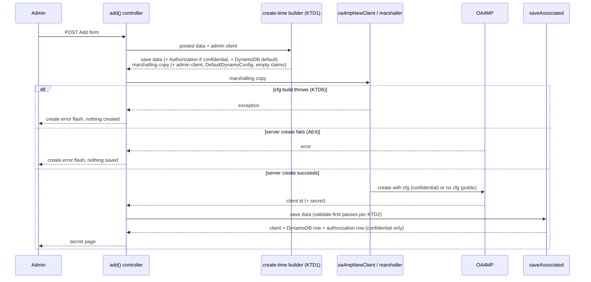

# Require Active Status Default for New OIDC Clients - Plan

## Goal Capsule

- **Objective:** Every confidential OIDC client created through the plugin enforces Require Active Status on the OA4MP server from the moment it exists, and the Authorization tab never shows Require Active Status as on unless that setting was actually saved.
- **Means:** Build the new client's create-time data once, with the authorization default and the admin client's defaults, and use it both for the OA4MP create request and for the plugin save (KTD1).
- **Product authority:** The developer. Existing clients are deliberately left as they are; backfilling them is not active scope. The Product Contract below wins on product behavior; KTDs win on mechanism.
- **Execution profile:** Four implementation units in one branch, one pull request. No `cfg_contract.json`, QDL, or `contract_version` change.
- **Stop conditions:** Stop and report if the create-time cfg cannot be made equal to the cfg a later edit sends for the same client (KTD3), if relaxing the authorization `client_id` rule breaks the Authorization tab's own save, or if OA4MP rejects or drops a cfg sent on client create (the plugin has only ever sent a cfg on edit).
- **Finishing:** `ce-work` implements and verifies with the hermetic suite; the developer runs the manual check in a running Registry with a reachable OA4MP server (Verification Contract) and merges.
- **Open blockers:** None.

---

## Product Contract

### Summary

A new confidential OIDC client is created with Require Active Status turned on, saved in the plugin and sent to OA4MP in the same create step. The Authorization tab stops assuming a default and shows the saved state, so an existing client with no saved setting shows the box unchecked.

### Problem Frame

Requiring an active CO Person record was meant to be the default for OIDC clients managed with the plugin. Today that default exists only in how the Authorization tab draws its checkbox: when a client has no saved authorization setting, the box renders ticked. Creating a client saves no authorization setting and sends none to OA4MP.

So an admin who creates a client and never opens the Authorization tab, or opens it and leaves without clicking Save, has a client that does not require Active Status, while the tab tells them it does. The plugin's sync check does not catch this, because a client with no authorization setting in the plugin and none on the server counts as in sync. The user manual repeats the claim that the box is checked "(the default)".

The cost is a silent policy gap. Users whose CO Person record is not active can reach clients the admin believes are protected, and nothing in the UI reveals it.

### Key Decisions

- **New clients only.** Existing clients keep whatever the server enforces today; no migration creates or changes their authorization setting. (session-settled: user-directed -- chosen over backfilling every client without a setting to require Active Status, and over leaving the create flow unchanged and fixing only the display: enabling enforcement on live clients could lock out users without warning.) Governs R1, R5.
- **Fixed default, not configurable.** Every new confidential client starts with Require Active Status on; admins turn it off afterward on the Authorization tab if needed. (session-settled: user-directed -- chosen over a pre-ticked checkbox on the Add form and over a per-admin-client default setting: simplest shape that makes the default real.) Governs R1, R3.
- **Confidential clients only.** Public clients get no authorization setting at creation, because OA4MP rejects custom configuration on public clients and Require Active Status travels only in that configuration. (session-settled: user-approved -- chosen over keeping the objective as "every OIDC client", which public clients cannot meet without an OA4MP change.) Governs R1, R2, R8.
- **Set at creation, in one step.** The setting reaches OA4MP in the same request that creates the client, not in a follow-up edit. (session-settled: user-approved -- chosen over create-then-save-authorization: a failure between two steps would leave a client without the default.) Governs R2.
- **Show the true state, with no nudge.** An existing client with no saved setting shows the box unchecked and carries no notice recommending Active Status. (session-settled: user-directed -- chosen over showing the true state plus a recommendation notice, and over keeping the box pre-ticked with a "not yet saved" notice: the tab must match what the server enforces.) Governs R4, R5.

### Requirements

**Client creation**

- R1. Creating a confidential OIDC client through the plugin saves Require Active Status as on for that client.
- R2. The newly created confidential client on the OA4MP server requires Active Status as soon as creation succeeds, with no further admin action.
- R3. A newly created client has no Active Status Redirect URL; blocked users receive the standard protocol error until an admin sets one.
- R8. Creating a public OIDC client saves no authorization setting for it.

**Authorization tab**

- R4. The Require Active Status checkbox reflects the saved setting: ticked only when Require Active Status is saved as on, unticked when it is saved as off or has never been saved.
- R5. Opening and saving the Authorization tab for an existing client with no saved setting leaves Require Active Status off unless the admin ticks the box.
- R6. After R1-R2, a new confidential client passes the plugin's sync check when the Authorization tab is opened.

**Documentation**

- R7. The user manual describes Require Active Status as on for newly created confidential clients, states that clients created before this change keep their existing setting (shown unchecked when none was saved), and states that public clients cannot require Active Status.

### Acceptance Examples

- AE1. **Covers R1, R2, R6.** **Given** an admin creates a new confidential OIDC client, **when** they open its Authorization tab without having saved anything there, **then** the box is ticked, the tab loads without a sync error, and a CO Person whose record is not active is refused by the client.
- AE2. **Covers R4, R5.** **Given** a client created before this change with no saved authorization setting, **when** an admin opens the Authorization tab, **then** the box is unticked; **when** they pick an authorization group and click Save without ticking the box, **then** the client still does not require Active Status.
- AE3. **Covers R4.** **Given** a client whose admin saved Require Active Status as off, **when** the Authorization tab is opened, **then** the box is unticked.
- AE4. **Covers R1, R2 (failure branch of one-step creation).** **Given** creating the client on the OA4MP server fails, **when** the admin sees the create error, **then** no plugin client exists with Require Active Status on and no server-side counterpart.
- AE5. **Covers R1, R2 (success branch of one-step creation).** **Given** creating the confidential client on the OA4MP server succeeds, **when** the plugin saves the new client, **then** the client and its Require Active Status setting are saved together, and the authorization setting never causes that save to fail.
- AE6. **Covers R8.** **Given** an admin creates a new public OIDC client, **when** creation succeeds, **then** no authorization setting is saved and the Authorization tab loads without a sync error.

### Scope Boundaries

- Backfilling, reporting on, or bulk-changing existing clients without a saved setting.
- A per-admin-client or per-CO choice of default.
- Changing how the Authorization tab treats public clients today; ticking Require Active Status on an existing public client is a pre-existing gap outside this work.
- A Require Active Status control or an Active Status Redirect URL field on the Add Client form.
- A notice on the post-create screen or the Authorization tab saying Active Status is required or recommended.
- Any change to the OA4MP-side QDL or to OA4MP's handling of public clients; the create path already carries this setting for confidential clients.
- Rolling back or reporting an OA4MP client orphaned when the plugin's own save fails after a successful server create; that risk exists today for any create.

### Dependencies / Assumptions

- New clients refuse CO People without an active record from day one, including an admin testing with a non-active record. Accepted as the intended effect of the default.
- The plugin's existing create request can carry the authorization setting to OA4MP for confidential clients, the same way the Authorization tab's save does, so no server-side change is needed. It sends no cfg for public clients.

### Sources / Research

- `Controller/Oa4mpClientCoOidcClientsController.php` -- `add()` builds and saves the new client with no authorization data.
- `View/Oa4mpClientAuthorizations/manage.ctp` -- the checkbox renders ticked whenever `require_active` is not set.
- `Model/Oa4mpClientOa4mpServer.php` -- `oa4mpNewClient()` and the edit path share the marshalling that emits `require_active_status` from the authorization row; the sync comparison treats "no row in plugin, none on server" as in sync.
- `Controller/Oa4mpClientAuthorizationsController.php` -- `manage()` pushes to OA4MP before saving the plugin row.
- `docs/oidc-client-plugin-manual.md` -- the "(the default)" wording for Require Active Status.
- The admin client's `DefaultDynamoConfig`, copied onto each new client in `add()`, is the existing create-time-default precedent. Unlike `Oa4mpClientDynamoConfig`, `Model/Oa4mpClientAuthorization.php` validates `client_id` as `required => true`, which matters for AE5 when the row is saved alongside a not-yet-saved client.
- `Model/Oa4mpClientOa4mpServer.php` `oa4mpMarshallContent()` attaches a cfg only for non-public clients, because OA4MP rejects custom configuration on public clients.
- No controller test drives `Oa4mpClientCoOidcClientsController::add()` or `Oa4mpClientAuthorizationsController::manage()`; create-time behavior is covered only indirectly at the model level (e.g. `Test/Case/Model/DynamoDefaultRotationTest.php`, `Test/Case/Model/SyncVerificationTest.php`).
- Product Contract preservation: Product Contract unchanged.

---

## Planning Contract

### Key Technical Decisions

- KTD1. **One create-time builder feeds both the server request and the plugin save.** A model-level method takes the posted Add-form data and the admin client and returns two arrays: the data to save, and a marshalling copy for `oa4mpNewClient`. `add()` calls it and nothing else builds create data. It makes the one-step creation decision testable without a controller harness, which does not exist for `add()`. (session-settled: user-approved -- chosen over create-then-save-authorization: a failure between two steps would leave a client without the default.) Governs R1, R2, R8.
- KTD2. **Relax `Oa4mpClientAuthorization.client_id` to `'required' => 'update'`.** `saveAssociated` validates hasOne children before the parent row exists and injects `client_id` only at save time, so `required => true` fails every create (CakePHP 2.10 `Model.php` validate-first; `ModelValidator.php` hasOne branch). The Authorization tab always posts `client_id`, so its save is unaffected. Chosen over passing `validate => true` to the whole create save, which would change validation for every associated row, and over a separate save in a transaction, which the one-step framing argues against. Governs R1, AE5.
- KTD3. **The create-time cfg must equal what a later edit sends.** Every edit path marshals from `Oa4mpClientCoOidcClient::current()`, which carries the admin client, its `DefaultDynamoConfig`, the per-client DynamoDB row, and a claims list. The marshalling copy must carry the same shape: the DynamoDB default copied before the server call (today it is copied after), the admin client with its `DefaultDynamoConfig` and `qdl_claim_source`, and an empty claims list. The admin client goes only into the marshalling copy, never into the save data, because `saveAssociated` with `deep` would re-save it. Without this, the new client's cfg carries null DynamoDB settings and every token request fails when the QDL opens DynamoDB. Governs R2, R6.
- KTD4. **One public-client predicate.** The create builder decides confidential versus public with the same test `oa4mpMarshallContent()` uses to withhold the cfg, extracted into one shared helper both call. Posted values are the strings `'0'` and `'1'`. Governs R1, R8.
- KTD5. **One "requires Active Status" predicate for send and display.** The marshaller's truthiness test on `require_active` and the Authorization tab's checkbox state come from one shared helper that reads the column value, never the presence of the association array. A client with no row yields a phantom all-null hasOne array (`docs/solutions/logic-errors/oa4mp-dynamo-config-hasone-phantom-null-array-2026-06-30.md`). The controller computes the checkbox state and passes it to the view. Governs R4, R5.
- KTD6. **`add()` catches a cfg-building failure and shows the create error.** Create never built a cfg before; now `cfg_contract.json` problems can throw inside `add()`. The throw happens before the server call, so no orphan is possible; catching it keeps the admin on the Add form with the existing `er.create_error` flash instead of an error page. Governs AE4.

### High-Level Technical Design

The create flow after this change. The builder (KTD1) runs once; its two outputs go to the server call and the plugin save.

### Assumptions

- `add()` catches cfg-building exceptions and flashes `er.create_error` (KTD6); this is a planning default, not a user decision.
- Create sets `require_active` to PHP `true`; the Authorization tab posts `'1'`. Sync compares loosely and the QDL checks presence only, so both are equivalent.
- Existing authorization rows with `require_active` NULL (possible, since the column has no default) now render unchecked. When such a row also has a redirect URL, the tab's on-load script clears it and the next save drops it. This is reachable only when the server is not enforcing Active Status for that client; the CHANGELOG notes it (U4).
- An admin client with no `DefaultDynamoConfig` already cannot create a client today; this plan adds no new failure there.

### Risks

- **OA4MP has never received a cfg on create.** Today the Add form's data triggers no cfg, and the live tier's create test sends none, so create-with-cfg is exercised only through edits. If the server rejects the body, every confidential create fails; if it drops the cfg, every new client reads back out of sync. Mitigation: the live-tier test added in U2 and the manual check in the Verification Contract; a stop condition covers it.
- **New clients run the claims QDL from creation.** Before, a new client carried no cfg and ran no QDL until its first edit. Now its first token request opens DynamoDB with the admin client's default settings. This is inherent to R2 and matches the state every client reaches after any edit, but the manual check confirms an active user can still log in to a freshly created client.

### Sequencing

U1 first (the save must be able to succeed), then U2 (the builder and `add()` wiring depend on it), then U3 (depends on U2 only for the shared predicate helper), then U4.

---

## Implementation Units

### U1. Let the authorization row save with a new client

**Goal:** A create-shaped `saveAssociated` call that includes an `Oa4mpClientAuthorization` hasOne row succeeds and stores exactly one row linked to the new client.

**Requirements:** R1, AE5; KTD2.

**Dependencies:** None.

**Files:**
- `Model/Oa4mpClientAuthorization.php`
- `Test/Case/Model/AuthorizationCreateSaveTest.php` (new)

**Approach:**
1. Change the `client_id` rule's `required` to `'update'`, keeping `numeric` and `allowEmpty => false`.
2. Leave the other hasOne models with `required => true` on `client_id` alone; none is in create data.

**Patterns to follow:** `Test/Case/Controller/AdminClientEditSaveTest.php` (DB-backed `saveAssociated` against the real schema, fixtures from `Test/lib/Oa4mpFixtures.php`).

**Test scenarios:**
- Covers AE5. A create-shaped array (client, openid scope, DynamoDB row, authorization `require_active => true`, no ids) saved with `deep => true` returns success; exactly one authorization row exists and its `client_id` is the new client's id.
- The same save without the authorization key still succeeds (no regression for public clients).
- An update-shaped authorization save that omits `client_id` fails validation, so the relaxation does not open a path to orphaned rows on update.
- Execution note: run the first scenario against the unchanged model and confirm it fails before changing the rule.

**Verification:** The new tests pass; the first one was seen red before the rule change.

### U2. Build create-time data once and send the default at creation

**Goal:** `add()` creates confidential clients with Require Active Status saved and sent in the same create request, and sends a cfg equal to what a later edit would send.

**Requirements:** R1, R2, R3, R6, R8, AE1, AE4, AE5, AE6; KTD1, KTD3, KTD4, KTD5, KTD6.

**Dependencies:** U1.

**Files:**
- `Model/Oa4mpClientCoOidcClient.php` or `Model/Oa4mpClientOa4mpServer.php` (the create-time builder; implementer picks the model that already owns the neighbouring logic)
- `Model/Oa4mpClientOa4mpServer.php` (extract the public-client and requires-Active-Status predicates into shared helpers used by `oa4mpMarshallContent()` and `oa4mpMarshallCfgQdl()`)
- `Controller/Oa4mpClientCoOidcClientsController.php` (`add()`)
- `Test/Case/Model/CreateTimeCfgTest.php` (new)
- `Test/Case/LiveServer/LiveClientLifecycleTest.php` (new non-gating live test: create a confidential client from the builder's marshalling copy, then verify it reads back in sync with `require_active` set)

**Approach:**
1. Add the builder (KTD1). For a confidential client (KTD4 predicate on the posted value) it adds an authorization entry with `require_active` true and no redirect URL (R3); for a public client it adds none (R8). It copies the admin client's `DefaultDynamoConfig` minus `id` and `admin_id` into the save data, which moves the copy that `add()` does today after the server call.
2. The builder's marshalling copy is a local array (not a reference to request data) with the save data plus the admin client, its `DefaultDynamoConfig`, and an empty claims list (KTD3).
3. In `add()`, replace the inline DynamoDB copy with the builder call, pass the marshalling copy to `oa4mpNewClient`, and pass the save data to `saveAssociated`. Keep the existing openid-scope and `proxy_limited` handling.
4. Wrap the server call so a cfg-building exception flashes `er.create_error` and returns (KTD6).
5. Extract the two predicates (KTD4, KTD5) as shared helpers; the marshaller calls them where it tests the same conditions today, with no behavior change for edits.

**Patterns to follow:** `Test/Case/Model/CfgMarshallingTest.php::testMarshalledContentHasNoCfgForPublicClient` (public/confidential control pair); `Test/Case/Model/SyncVerificationTest.php` (`serverObject()`, round trip through `oa4mpUnMarshallContent`); `Test/Case/Model/SyncOptionalSectionsTest.php` (`captureWarnings()`); `resolveDynamoConfig()` as the shared-resolver precedent.

**Test scenarios:**
- Covers AE1. Posted `public_client => '0'`: the builder's save data has an authorization entry with `require_active` true; the marshalled content's cfg carries `require_active_status` true.
- Covers AE6. Posted `public_client => '1'`: no authorization entry in save data; marshalled content has no `cfg` key.
- The confidential create cfg carries non-null DynamoDB module settings equal to the admin client's `DefaultDynamoConfig`, and a `qdl.load` equal to the admin client's `qdl_claim_source`. These are asserted directly, not through the sync verdict, because sync skips the DynamoDB comparison when the server copy is empty.
- Equality: the cfg marshalled from the builder's copy equals the cfg marshalled from a `current()`-shaped array for the same client after save (ignoring `comment` and extra keys). This locks KTD3.
- Round trip: the create cfg, unmarshalled with `oa4mpUnMarshallContent`, compared by `isClientDataSynchronized` against the saved client shape, is in sync. The same holds after the authorization row is flipped to `require_active` false and re-marshalled.
- Marshalling the confidential create copy raises no PHP warnings (`captureWarnings()`).
- The marshaller's behavior for an edit-shaped client with a phantom all-null authorization row is unchanged: no `require_active_status` emitted.
- Live tier (non-gating): creating a confidential client on a real OA4MP server from the builder's marshalling copy succeeds, and verification reads it back in sync with `require_active` set.
- Execution note: the scenarios for DynamoDB values and the equality check must be seen failing against a builder that omits the admin client, to prove they can fail.

**Verification:** New tests pass; `php -l` is clean on changed files; existing marshalling and sync tests still pass unchanged.

### U3. Show the saved Require Active Status on the Authorization tab

**Goal:** The checkbox is ticked only when Require Active Status is saved as on.

**Requirements:** R4, R5, AE2, AE3; KTD5.

**Dependencies:** U2 (shared predicate).

**Files:**
- `Controller/Oa4mpClientAuthorizationsController.php` (`manage()` sets the checkbox state as a view variable from the shared predicate)
- `View/Oa4mpClientAuthorizations/manage.ctp` (use the view variable instead of `isset(...) ? ... : true`)
- `Test/Case/Model/RequireActivePredicateTest.php` (new)

**Approach:**
1. `manage()` computes the state from the client's authorization data with the KTD5 helper and passes it to the view.
2. The view uses it for `checked`. The existing on-load toggle then hides the redirect URL field for unchecked boxes; no script change.

**Patterns to follow:** `Test/Case/Model/CfgMarshallingTest.php` resolver tests for phantom rows (`testResolveDynamoConfigFallsBackWhenPerClientIsPhantomNull`).

**Test scenarios:**
- Covers AE2. A phantom all-null authorization array yields unchecked.
- Covers AE3. A saved row with `require_active` false (and `'0'`) yields unchecked.
- A saved row with `require_active` true (and `'1'`) yields checked.
- A saved row with `require_active` NULL yields unchecked.
- The marshaller and the checkbox agree for each of the four inputs above (same helper), so display cannot drift from what is sent.

**Verification:** New tests pass; a manual visit to the tab for a legacy client shows the box unchecked and the redirect field hidden.

### U4. Manual, CHANGELOG, and test-count floor

**Goal:** Operators read accurate documentation, and the suite's count gate reflects the new tests.

**Requirements:** R7.

**Dependencies:** U1, U2, U3.

**Files:**
- `docs/oidc-client-plugin-manual.md` (Require Active Status section)
- `CHANGELOG.md` (add a `## Unreleased` heading above the latest release)
- `Test/run.sh` (`min_tests_run`)

**Approach:**
1. Rewrite the Require Active Status bullet per R7.
2. Add CHANGELOG bullets in the file's style: new confidential clients require Active Status from creation; the Authorization tab shows only the saved setting; rows saved with no value now show unchecked and a stored Active Status Redirect URL on such a row is cleared on the next save.
3. Raise `min_tests_run` to a few below the new passing count, per `Test/README.md` ("The three gates").

**Test expectation:** none -- documentation and gate configuration; the gate itself is exercised by running the suite.

**Verification:** `Test/run.sh` passes with the raised floor.

---

## Verification Contract

| Check | Command or action | Applies to | Done signal |
|---|---|---|---|
| Lint | `php -l` on every changed PHP file | U1, U2, U3 | No syntax errors |
| Hermetic suite | `Test/run.sh` (Docker) | All units | Exit 0, `ALL_TESTS_PASSED`, count at or above the raised `min_tests_run` |
| Verified red | Run each new regression test against pre-change code | U1, U2, U3 | Each named test was observed failing first |
| QDL conformance | Not required: no `cfg_contract.json`, QDL, or `contract_version` change | -- | Stated in the PR body |
| Live tier (developer) | `Test/run-live.sh` for the new create-with-authorization test in `LiveClientLifecycleTest` | U2 | The server accepts the create cfg and reads back `require_active` set, in sync |
| Manual (developer) | In a running Registry with a reachable OA4MP server: create a confidential client, open its Authorization tab, confirm the box is ticked with no sync error, confirm a non-active CO Person is refused and an active CO Person can log in; create a public client and confirm its tab loads | U2, U3 | Observed as described |

The live-server tier (`Test/run-live.sh`) is non-gating in CI and needs a real credential, so the hermetic suite cannot prove R2 against a real server; the live-tier and manual rows above are the developer's pre-merge proof that OA4MP accepts a cfg on create.

---

## Definition of Done

- R1-R8 hold and AE1-AE6 are covered by the tests named in U1-U3 or by the manual check.
- `Test/run.sh` passes with the raised count floor; every new regression test was observed red before its fix.
- The manual and CHANGELOG reflect the change (U4).
- The developer has run the live-tier create test and the manual check in the Verification Contract, or the pull request states that they are still pending.
- No `cfg_contract.json`, QDL, or `contract_version` change is in the diff.
- No abandoned or experimental code remains in the diff, and no untouched code was reformatted.
